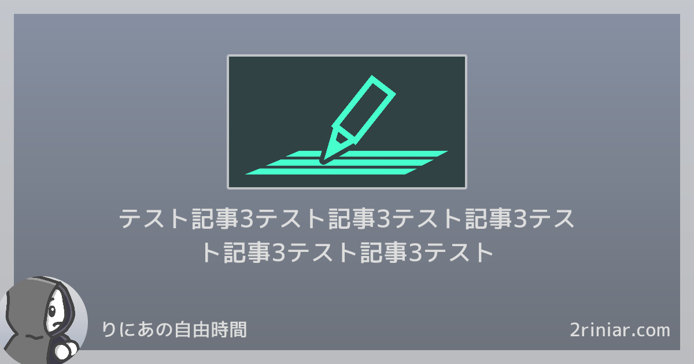
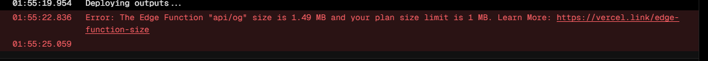
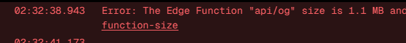
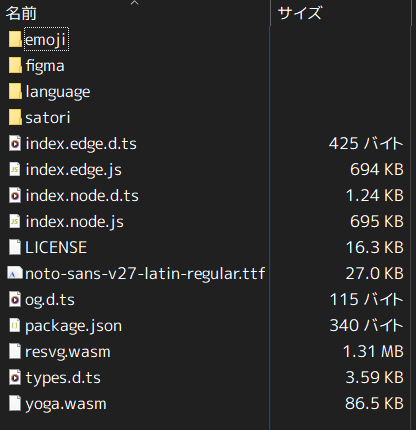
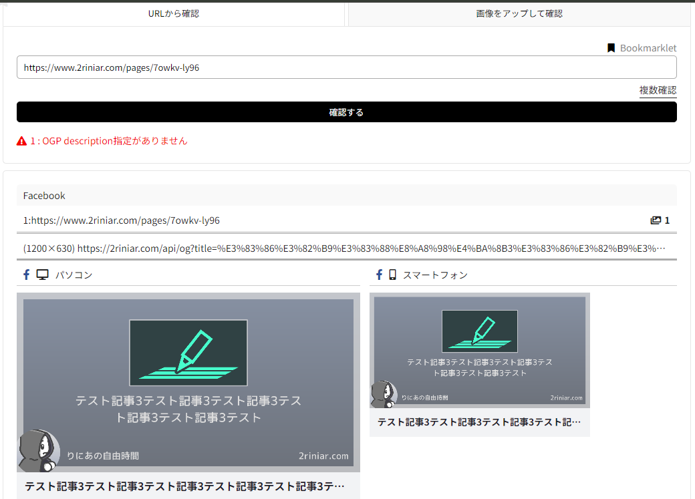
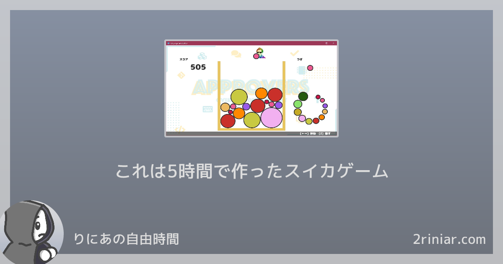

Next.jsで個人ブログサイトを作ってるときに、OGP（Open Graph Protocol）の画像を動的にしたかった。せっかくNext.js使ってるから、Nextの機能でAPI作って返す方法探してみたら [ImageResponse](https://nextjs.org/docs/app/api-reference/functions/image-response) なるものを見つけたので、試してみた。

どうやら普段ページを作るのと同じく、jsxを描くだけで画像が作れるらしい。



以下環境

*   next.js v14.1.0（App Router）
*   typescript v5.3.3
*   デプロイ先: Vercel

# 画像を返すAPIを生やす

今更だけど、Nextではページとは別にAPIを生やすことができる。このAPIは実行場所をedgeかnodeサーバーか選ぶことができ、サイト制作のちょっとした機能を作るのに使える。

今回は各ページの内容から動的にOGPの画像を生成したいので、「タイトル」と「サムネ画像」をクエリパラメータとして画像を生成して返すAPIを作り、ページの `og:image` タグにこのURLを指定することにした。

ディレクトリ構成はこんな感じ。App Routerではどこにファイルを配置するかによってURLのパスが変わるんだけど、今回は `/api/og` に置くことにした。

```
(root)
 └ app/
   └ api/
     └ og/
       └ route.tsx
```

ここにハンドラ関数を作って、next/ogのImageResponseを使って結果を返すようにする。

```typescript:route.tsx
import { ImageResponse } from "next/og";
import { NextRequest } from "next/server";

export async function GET(request: NextRequest) {
  const { searchParams } = new URL(request.url);
  return new ImageResponse(/* ここに色々渡す */);
}
```

ページ側からは、このAPIのURLを叩くようにする。

このとき、描画に必要な情報だけをクエリパラメータで渡すようにした。そうじゃないと、ページ生成側とAPI側でデータ取得が重複してしまう。

```typescript:page.tsx
export const generateMetadata = async ({ params, searchParams }: Props) => {
  const data = await getDetail(params.slug, { draftKey: searchParams.dk });  // データを取ってくる外部関数
  return {
    openGraph: {
      url: siteUrl,
      title: `${data.title} - ${siteName}`,
      siteName: siteName,
      type: "article",
      images: {
        // 作ったAPIのURLを指定
        url: `${siteUrl}/api/og?title=${data.title}${data.thumbnail?.url !== undefined ? `&thumbnail=${data.thumbnail.url}` : ""}`,
        width: 1200,
        height: 630
      },
    },
    /* その他色々 */
  };
};
```

# 画像を生成するためのjsxを組む

ImageResponseにJSXを渡すことで画像を描画できるので、タイトルとサムネイルを渡してデザインを組んでいく。

```typescript:page.tsx
import { ImageResponse } from "next/og";
import { NextRequest } from "next/server";

export async function GET(request: NextRequest) {
  const { searchParams } = new URL(request.url);
  return new ImageResponse(
    <OgImage
      title={searchParams.get("title") ?? ""}
      thumbnail={searchParams.get("thumbnail") ?? undefined}
    />
  );
}

type OgImageProps = {
  title: string;
  thumbnail: string | undefined;
};

const OgImage = ({ title, thumbnail }: OgImageProps) => (
  <div>
    {/* 中身のデザイン */}
  </div>
);

```

## 思うようにCSSが効かない問題

next/ogでは内部的に[satori](https://github.com/vercel/satori)を使用しているため、いくつか制約がある点に注意。

*   スタイル指定はCSSではなく、react側のstyleプロパティに直接指定する必要がある。
*   子要素を持つdiv要素には `display: none` または `display: flex` のみ指定可能。
*   transformの挙動が怪しかったので、位置を直接指定したりして使うのを避けた。

長くなるので一部だけだけど、こんな感じで実装した。

```typescript:route.tsx
const OgImage = ({ title, thumbnail }: OgImageProps) => (
  <div
    style={{
      display: "flex",
      position: "relative",
      background: "linear-gradient(to bottom, #8791a3 0%, #6c717a 100%)",
      width: 1200,
      height: 630,
      color: "#dddddd",
      border: "solid 24px rgba(221, 221, 221, 0.7)",
    }}
  >
    
    <div
      style={{
        display: "flex",
        justifyContent: "center",
        alignItems: "center",
        fontSize: 42,
        position: "absolute",
        width: 800,
        height: 100,
        top: 330,
        left: 176
      }}
    >
      <p
        style={{
          margin: 0,
          textAlign: "center"
        }}
      >
        {title}
      </p>
    </div>
    {/* その他諸々 */}
  </div>
);

```

## devサーバーでレンダリング結果を見たい

[Advanced Features: デバッグ | Next.js](https://nextjs-ja-translation-docs.vercel.app/docs/advanced-features/debugging)  
nextのserverless APIは、デバッグ時にdevサーバーを以下のオプションで起動する必要がある。

```shell
NODE_OPTIONS='--inspect' next dev
```

これを、 `package.json` のscriptsに指定して上げれば良い。

ちなみにWindowsの場合は、npmから `cross-env` をインストールして以下のようにする必要がある。

```shell
cross-env NODE_OPTIONS='--inspect' next dev
```

成功すると、無事にdevサーバーで画像生成のAPIを実行し、レンダリング結果をブラウザから確認することができる。

当たり前だが、APIで画像を生成しているので、動的プレビューやDevToolsを利用することはできない。

## カスタムフォントを使いたい

フォントを使う場合、ローカルからバイトデータを読み込んでくる必要がある。

[Open Graph (OG) Image Examples](https://vercel.com/docs/functions/og-image-generation/og-image-examples)  
ここを参考に、フォントの読み込みを実装した。

ただし、後述する理由でedge runtimeでの実行を断念してnodeで動かしているため、fetch APIではなくfsを使用している。  
[How can I use files in Serverless Functions on Vercel?](https://vercel.com/guides/how-can-i-use-files-in-serverless-functions)

ちなみに、next/ogの前身は@vercel/ogなので、こちらの名前で検索すると情報が出てきやすい。

```typescript:route.tsx
export async function GET(request: NextRequest) {
  const { searchParams } = new URL(request.url);
  const font = await fs.readFile(path.join(process.cwd(), "assets", "mplus-2c-medium.ttf"));
  return new ImageResponse(
    <OgImage title={searchParams.get("title") ?? ""} thumbnail={searchParams.get("thumbnail") ?? undefined} />,
    {
      fonts: [
        {
          name: "m-plus-2c",
          data: font,
          weight: 500,
          style: "normal"
        }
      ]
    }
  );
}
```

フォントファイルは以下のように配置している。ライセンス表記も同じ階層に配置。

```
(root)
 └ assets/
   ┝ OFL.txt
   └ mplus-2c-medium.ttf
```

これで、あとはnameに指定したフォントを `fontFamily` に指定すればOK。成功すると、無事に指定したフォントが使用されるのを確認できる。

```typescript:route.tsx

const OgImage = ({ title, thumbnail }: OgImageProps) => (
  <div
    style={{
      fontFamily: '"m-plus-2c"',
      fontWeight: 500,
      fontStyle: "normal",
      // その他諸々
    }}
  >
  // 以下省略
  </div>
);
```

# Vercelにデプロイ

画像生成のAPIが出来たので、ここからはデプロイ先のVercelで動かしてみる。Vercelに乗せる際はいつもと変わらず、GitHubのリポジトリを指定してあげれば勝手にデプロイされる。

## サイズ制限でEdgeに乗らない問題

edge runtimeで実行しようとしたけど、サイズ制限に引っかかってデプロイできなかった。Vercelのedgeでの容量制限は1MB以内で、これはedgeで実行する `route.tsx` が参照しているすべてのモジュールやファイルを集めてgz圧縮した状態での容量となっている。



使用したカスタムフォントが大きいのかなと思い、subset化やwoff形式による圧縮でなんとか頑張ったけど、1MB以内に収めることはできなかった。



カスタムフォントを完全にのぞいてミニマルな状態でデプロイしても制限に引っかかったので、next/ogの中身を見てみたら1MB越えのwasmファイルを発見。てっきりフォールバックフォントが重いのかと思ってたから意外だった。



ミニマルな状態でもedgeに乗らないということで、仕方なくnodeで動かすことにした。にしてもサンプルではedge runtimeで動かしているんだけどな......

聞いた話によると、next/ogは最近実装が変わってサイズが増えたとかなんとか。ほんとに聞いた話だけど。

# 完成

最後に、無事にOGPの画像を指定できているかをOGPチェッカーで確認。  
[OGP確認：facebook、twitter、LINE、はてなのシェア時の画像・文章を表示 | ラッコツールズ🔧](https://rakko.tools/tools/9/)



無事に生成出来てそう。discordでも問題なし。


というわけで、無事に当サイトのOGPの画像を動的に生成することができた。めでたしめでたし～

どうでもいいけど、クエリパラメータを手動で指定すれば存在しない記事を捏造することができる。悪用はやめてね

[https://www.2riniar.com/api/og?title=これは5時間で作ったスイカゲーム&thumbnail=https://pbs.twimg.com/media/F8\_WzWQaIAAQCDT?format=jpg&name=medium](https://www.2riniar.com/api/og?title=%E3%81%93%E3%82%8C%E3%81%AF5%E6%99%82%E9%96%93%E3%81%A7%E4%BD%9C%E3%81%A3%E3%81%9F%E3%82%B9%E3%82%A4%E3%82%AB%E3%82%B2%E3%83%BC%E3%83%A0&thumbnail=https://pbs.twimg.com/media/F8_WzWQaIAAQCDT?format=jpg&name=medium)

