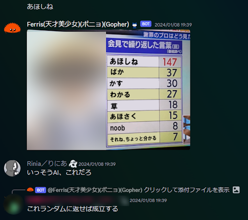
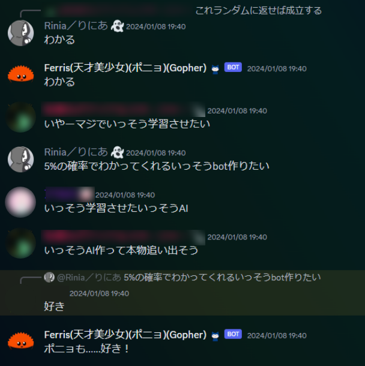
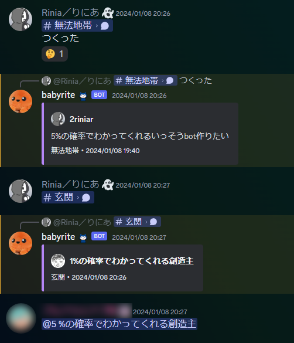
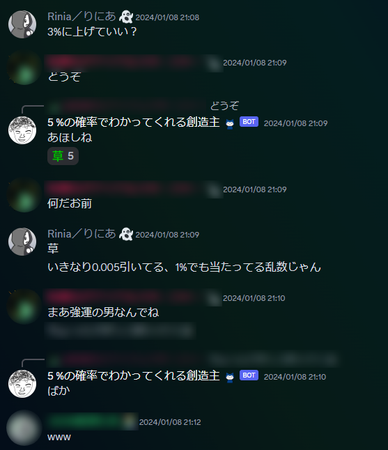
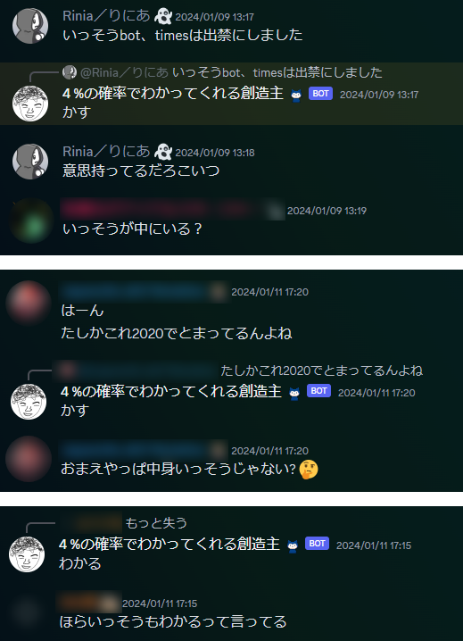
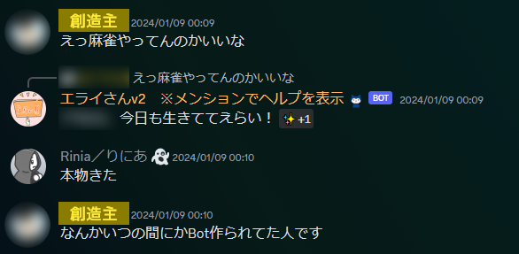
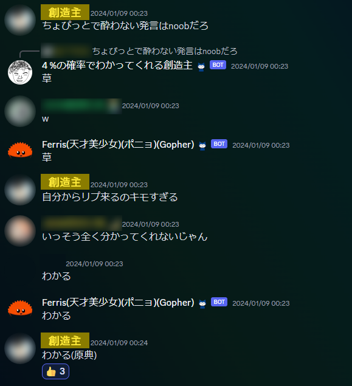
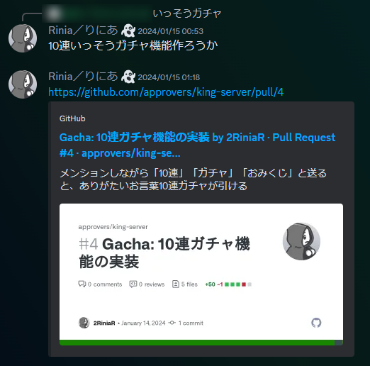
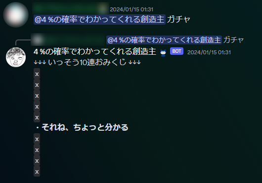
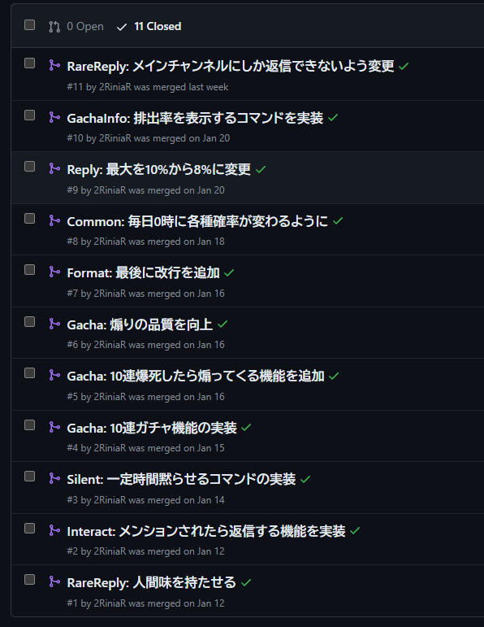

[限界開発鯖](https://approvers.dev/)の[創造主](https://twitter.com/kousou4129)は、我らが下界 **_†UNDERGROUND†_** に全然姿を現さない。このままでは農村の民々は飢饉に耐えられず、限界開発がやめられなくなってしまう。

そこでsudoの絶対的権力を行使して、創造主を降臨させてよい法案が治外法権により成立した。

# 創造主を模倣したdiscord botが誕生

**創造主を学習させたAI作りたいね～** って話が出てた時。

創造主（いっそう）の語彙があまりに脳内再生余裕であることから、幣鯖には上のようなコラ画像が存在する。

これをランダムに返せばもうそれは創造主だろっていうことで、 **discord botを作った。**

メッセージを送信したときに、 **5%の確率で以下の中からランダムなメッセージを返せばいい。**

*   「あほしね」「ばか」「かす」「わかる」「草」「あほくさ」「noob」「それね、ちょっと分かる」

以前作ったbotの実装を流用して、45分くらいで出来た。

メッセージを送ったときに、低確率で創造主が返信をしてくるようになった。

ちなみにアイコンは幣鯖の[天皇](https://twitter.com/Colk_)が描いたらしい。特徴を捉えすぎてる。

# 実質本人

あまりに本人再現すぎて、 **本人が中にいる疑惑** が出てきた。

いやわかる。よく言う語彙を集めてランダム出力してるだけなのに、マジで本人の声が聞こえるのおもろい。

そして **本人登場。**

こんなしょうもないことに付き合わせちゃってごめんね。。。ごめんね。。。

ちなみに「5%の確率でわかってくれる創造主」とあるが、 **5%の確率で返信してくるだけであって必ずしも共感してくれるわけじゃない** ので、名前詐欺である。

# 神は告げた。「うるさくて草」

創造主botは完全にノリと勢いで作ったので、 **機能追加もその場のノリ** でする。

例えば、メッセージ連投してガチャを引くメンバーがいたので

**10連ガチャが引けるようにした。** この間25分。

その他にも、色々とノリで機能を追加した。

*   メンションに返事する
*   「黙れ」で5分間だけ黙る
*   10連ガチャで爆死したら煽る
*   返信確率とメッセージの分布が毎日変わる

こうして、無事に実質創造主を降臨させることができ、幣鯖には安寧が訪れた。

# 限界開発鯖、4周年

今回の舞台となった[限界開発鯖](https://approvers.dev/)は、今日（限界標準時に準拠）で4周年らしい。おめでとうございます！ ！

そして3/16(土)には、 **4周年を記念した外部参加OKなLT会** があるとのこと。 楽しみ！

実は今回の記事も、ちょうど周年でタイミングが良かったので書くことにした。

入った当時まだ「高専入学しました！」とか言ってたメンバーも、もう就職とか大学編入をしようとしてて時の流れを感じる......これからもゆるくよろしくお願いします～