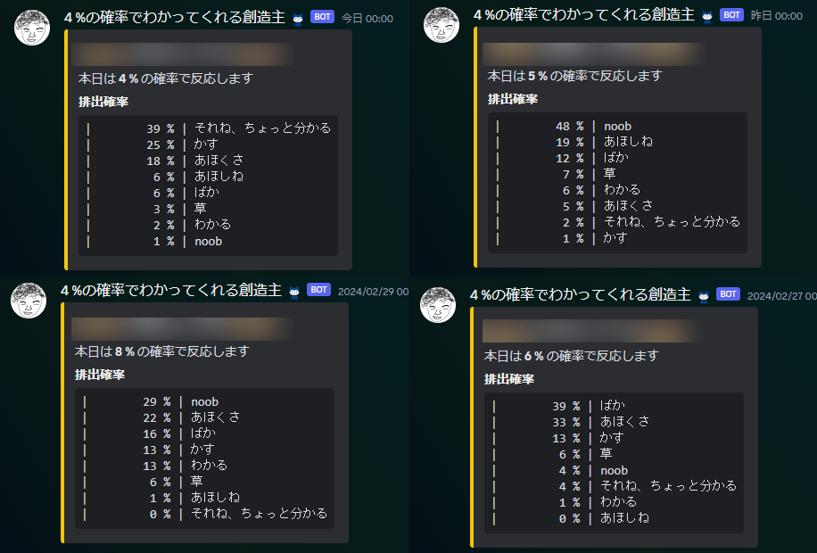
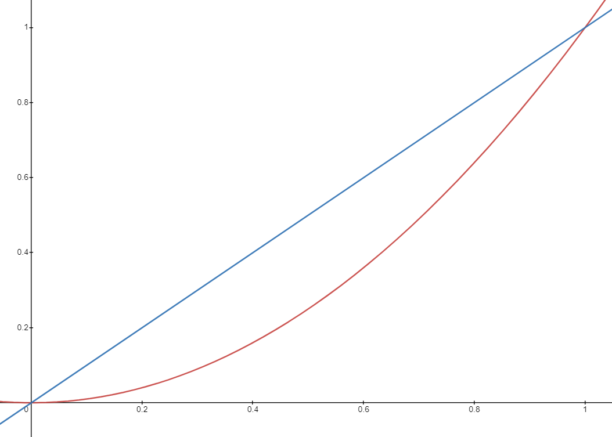

ランダム排出の確率を決める時に、 **「39%, 25%, 18%, 6%, 6%, 3%, 2%, 1% ...」** みたいな程よいばらつきがある確率分布を安定して生成する方法。（創造主botでメッセージの抽選に使用したもの）



# 実装

実装は[ここ](https://dotnetfiddle.net/cyaliT)で試せる。

```csharp
// 確率分布を生成する
public static float[] GenerateRates(int count)
{
    var borders = Enumerable.Range(0, count - 1)
        .Select(x => (float)Math.Pow(Random.NextDouble(), 2))
        .Select(x => (int)Math.Floor(x * 100f))  // 確率は0.01区切りにしたいので、100かけてfloor
        .OrderBy(x => x)
        .ToList();
    borders.Add(100);
    var indices = Enumerable.Range(0, count).Shuffle().ToList();  // それぞれの範囲を何番目に割り当てるか
    var rates = new float[count];

    // それぞれの範囲を計算する
    // 最後は0~1の値で欲しいので100で割る
    rates[indices[0]] = borders[0] * 0.01f;
    for (var i = 1; i < count; i++)
    {
        rates[indices[i]] = (borders[i] - borders[i - 1]) * 0.01f;
    }

    return rates;
}

// 順番をシャッフルする
private static IEnumerable<T> Shuffle<T>(this IEnumerable<T> list)
{
    return list.OrderBy(_ => Guid.NewGuid());
}
```

N-1個の0.0～1.0の実数をランダムに生成して、それぞれの値を2乗して小さい順にソート。すると、0.0～1.0の間にN個の範囲ができるので、それらをランダムな順番で割り振っていくことで実現している。

# 解説

数直線上に等間隔に点を打ったとして、それを2乗すると右へ行くほど点同士の間隔が大きくなる。


この点と点の間にできた空間をランダムに割り当てていけば、いい感じにバラついていいよねという話。

グラフにするとこんな感じ。微分すると分かりやすい。

