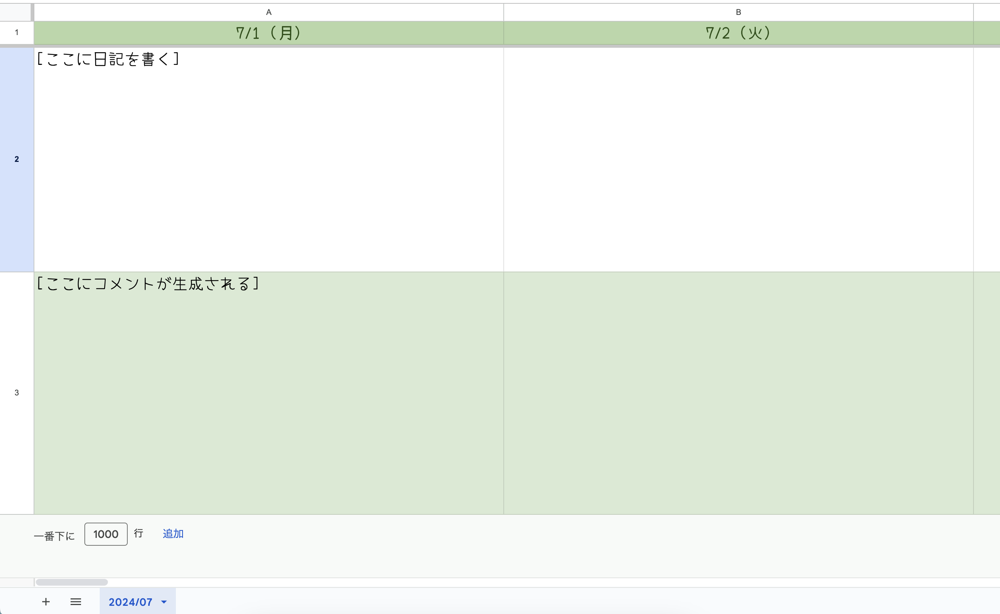
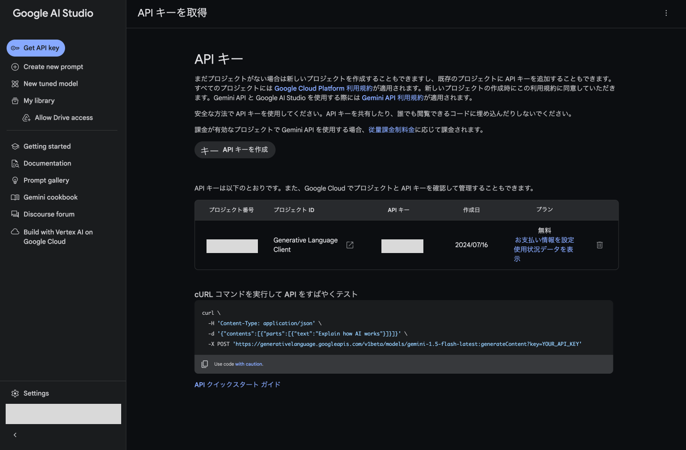
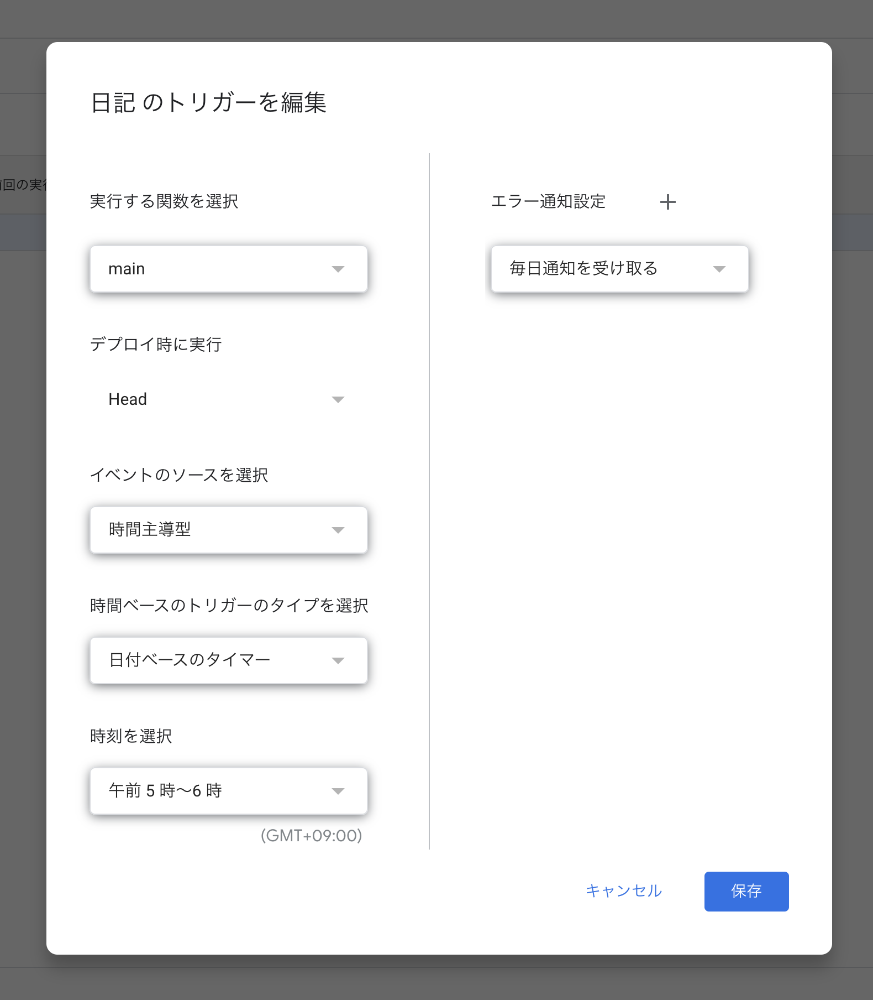
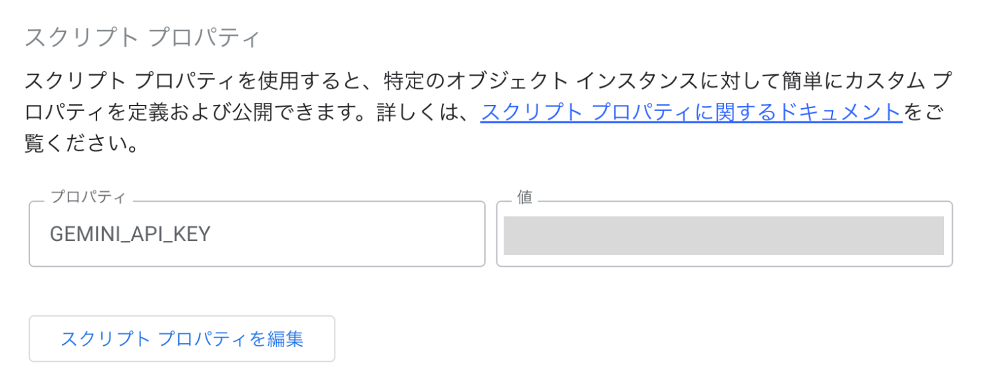
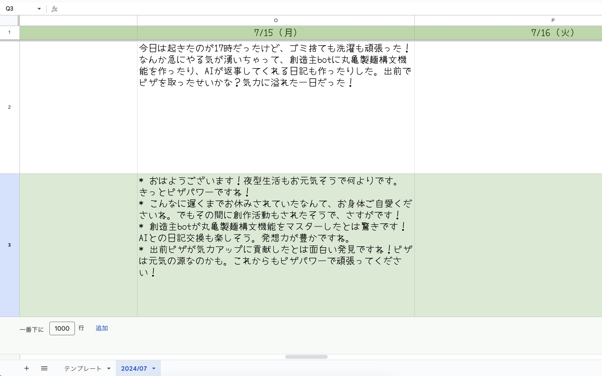

# はじまり

日記は恥ずかしいので誰かに見られたくないけど、完全な独り言だと寂しいのでAIにリアクションしてもらうことにした。

今回はGAS（Google App Script）を使用してスプレッドシートから日記を読み込み、生成AI「Gemini」に生成してもらったコメントを書き込むようにする。

https://x.com/2RiniaR/status/1812904616260214986?ref_src=twsrc%5Etfw

# シートを作る

横向きが好きなので横向きで、GASで操作しやすいようにシンプルな作りにする。

*   シート名は `2024/07` の形式
*   1行目に日付を `7/1 (月)` の形式で書く
*   2行目に日記の内容を入力
*   3行目にコメントが生成される



# GeminiのAPIキーを取得

以下からAPIキーを取得する。  
[https://aistudio.google.com/app/apikey](https://aistudio.google.com/app/apikey)

生成するとこんな感じ。ここのAPIキーをGASで使用する。当然だけど、APIキーは公開厳禁。



# GASを実装

実装全体はGistに公開してるので、真似したい人は読んでね。  
[https://gist.github.com/2RiniaR/ad9c239d612f0ab99d683f6762fff172](https://gist.github.com/2RiniaR/ad9c239d612f0ab99d683f6762fff172)

やることは以下。

*   毎日朝5時に実行されるようにする
*   前日の日記をシートから読み込む
*   読み込んだ内容をGeminiに送信し、コメントを取得
*   取得したコメントをシートに書き込む

まずは毎日朝5時に実行するところから。  
GASの「トリガー」から、以下のトリガーを追加。



そしたら実行するコードを書いていく。以下は簡略版なので完全版はGistを見てね。  
まずはAI生成以外の部分だけ実装する。

```javascript:main.gs
const spreadsheet = SpreadsheetApp.getActiveSpreadsheet();

function main() {
  const now = new Date();
  const targetDate = new Date(now.getFullYear(), now.getMonth(), now.getDate() - 1);

  // 今月のシートを取得する
  const sheetName = Utilities.formatDate(targetDate, 'JST', 'yyyy/MM');
  const sheet = spreadsheet.getSheetByName(sheetName);

  // 昨日の日付が書いてあるセル（1行目）を取得する
  const cellName = Utilities.formatDate(targetDate, 'JST', 'M/d ({曜日})').replace('{曜日}', getDayFormat(targetDate));
  const dateCell = sheet.getRange(1, 1, 1, sheet.getLastColumn()).createTextFinder(cellName).findNext();

  // 2行目から日記の内容を取得する
  const content = sheet.getRange(2, dateCell.getColumn()).getValue();

  // Gemini APIを叩いてコメントを生成する
  const comment = generateCommentFromAI(content);

  // 3行目に生成したコメントを書き込む
  sheet.getRange(3, column).setValue(comment ?? 'コメントが取得できませんでした。');
}

// 曜日表記を取得
function getDayFormat(date) {
  const days = ['日', '月', '火', '水', '木', '金', '土'];
  return days[date.getDay()];
}

function generateCommentFromAI(content) {
  // ToDo: 実装
}
```

やってることはそのまま。今月のシートから昨日の日付のセルを探してきて、その列に書いてある日記本文を読んでるだけ。

次に、AI生成部分。自前でGemini API用のリクエストを構築して、その結果をパースして読む。

```javascript:main.gs
const GEMINI_API = PropertiesService.getScriptProperties().getProperty('GEMINI_API_KEY');

function generateCommentFromAI(content) {
  const queryLines = [
    'SNSに投稿された以下の日記に対して、彼のファンとしてコメントを4つ挙げてください。ただし、各コメントは140字以内で、箇条書きの形式でお願いします。回答以外の内容は含めないでください。',
    '',
    '```',
    content,
    '```'
  ];

  const url = `https://generativelanguage.googleapis.com/v1beta/models/gemini-pro:generateContent?key=${GEMINI_API}`
  const payload = {
    'contents': [
      {
        'parts': [{
          'text': queryLines.join('\n')
        }]
      }
    ]
  }
  const options = {
    'method': 'post',
    'contentType': 'application/json',
    'payload': JSON.stringify(payload)
  };

  // API通信
  const res = UrlFetchApp.fetch(url, options);

  const resJson = JSON.parse(res.getContentText());
  if (resJson && resJson.candidates && resJson.candidates.length > 0) {
    return resJson.candidates[0].content.parts[0].text;
  } else {
    return null;
  }
}
```

Geminiに送る文章はこんな感じ。ベストプラクティスとかあんまりわかってないけど、使えればいいやの精神。

> SNSに投稿された以下の日記に対して、彼のファンとしてコメントを4つ挙げてください。ただし、各コメントは140字以内で、箇条書きの形式でお願いします。回答以外の内容は含めないでください。  
>   
> \`\`\`  
> ここに本文  
> \`\`\`

リクエストには先ほど取得したAPIキーを送信する必要がある。  
ただ、コードに直書きはセキュリティ的にやりたくないので、今回はGASのスクリプトプロパティを使用。  
「設定」から以下のように設定することで、スクリプトから読めるようになる。



最後に、保存して試しに実行したら完成。

# 完成

いい感じに動いてるっぽい。いかにもAI生成〜って感じの文章なので、この辺は改善の余地ありかな。  
みんなもぜひお試しあれ。朝起きるのがちょっと楽しみになる。



# 最後に

つい昨日からGPT-4o miniなるものが出て、今までにない高精度・高速・安価な生成AIとして注目を集めているらしい。  
今のところはGeminiを使ってるけど、いつか乗り換えてもいいかも。