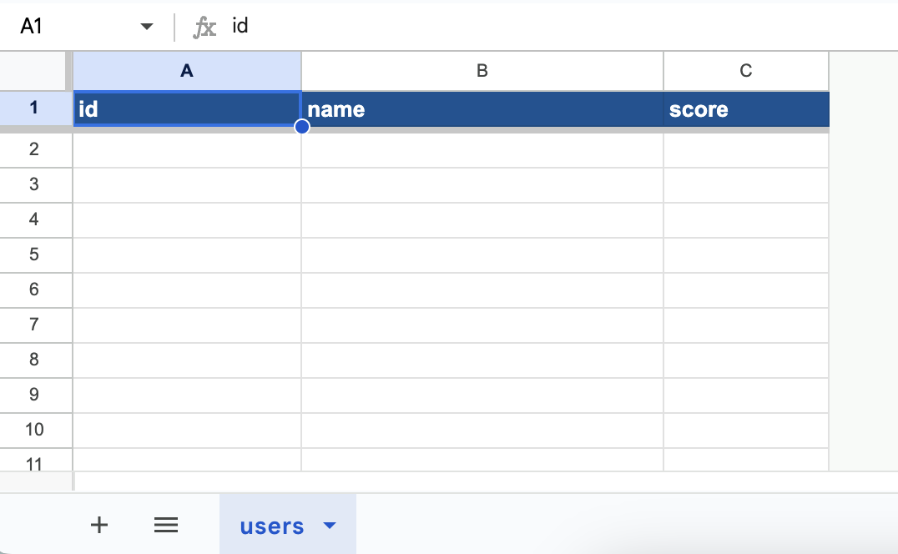
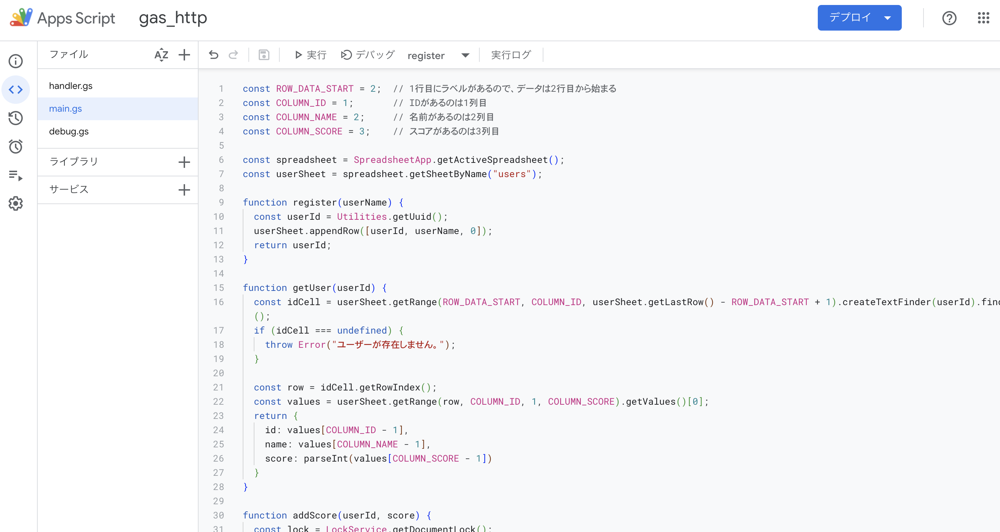
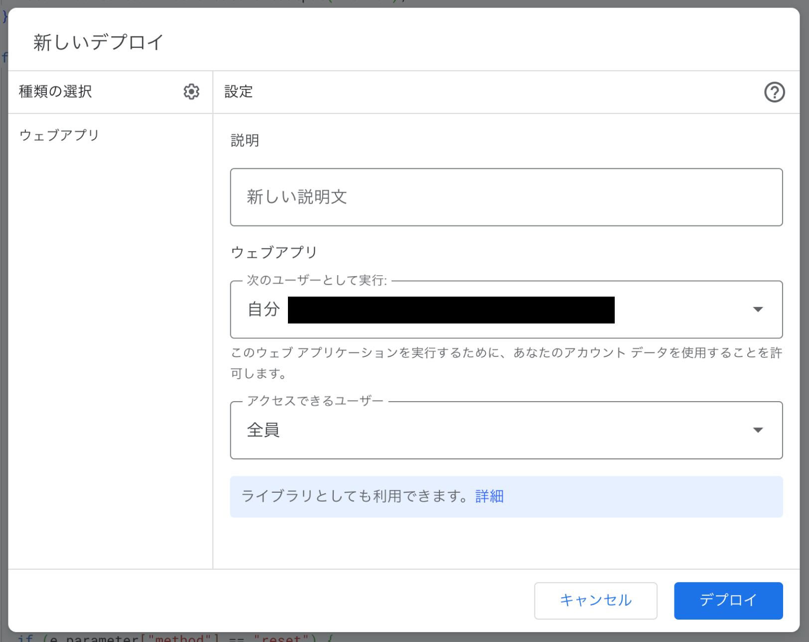
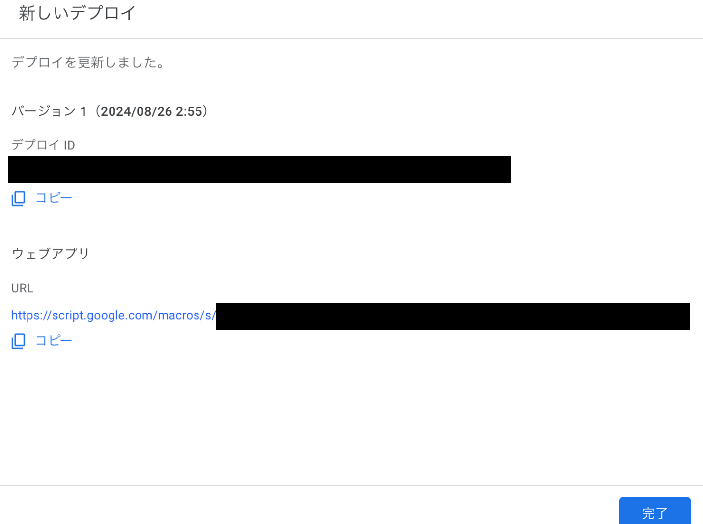
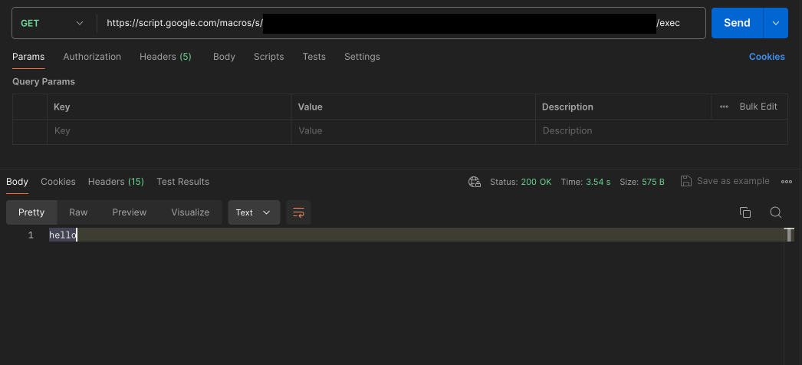
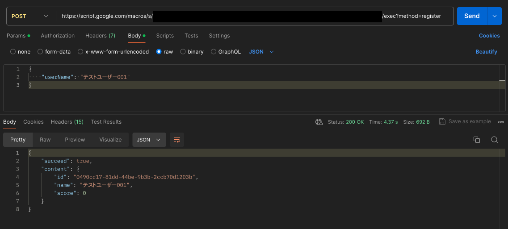
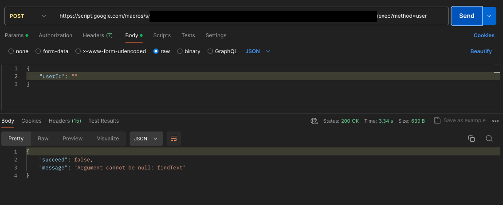

Google App Script（GAS）はHTTPサーバーとして機能させられるので、スプレッドシートと組み合わせて簡易的なWebアプリを構築することができる。[公式ドキュメント](https://developers.google.com/apps-script/guides/web?hl=ja)

それに無料。注意点と対処法は以下。

*   **応答に数秒かかる**
    *   頻繁にAPIを叩くアプリには向かない。定期実行とか、クライアント計算が主なアプリに使う。
*   **200しか返せない**
    *   Result型みたいに `{ "succeed": true, "content": content }` って感じのデータで返す。しゃーない。
*   **GETとPOSTしか対応してない**
    *   メソッドの意味ガン無視になるけど、全部POSTでやる。しゃーない。
*   **ルーティングに対応してない**
    *   クエリパラメータで代用する。しゃーない。

# 実装サンプル

今回は適当なサンプルアプリを作った。

## シート

データストアの役割になるので、こんな感じのシートを作る。 `id, name, score` の3つのカラムがあるだけのDBテーブルって感じ。



## メインロジック

GASを開き、スクリプトを書いていく。



今回は以下4つの機能を作った。

*   ユーザーを登録（ **UUID生成、行の追加** ）
*   ユーザーを取得（ **行検索、セル読み込み** ）
*   特定ユーザーのスコアを加算（ **排他制御、行検索、セル読み書き** ）
*   全ユーザーのスコアをリセット（ **範囲指定してセル上書き** ）

**非同期処理はない** ので、全部同期で。

```javascript:main.gs
const ROW_DATA_START = 2;  // 1行目にラベルがあるので、データは2行目から始まる
const COLUMN_ID = 1;       // IDがあるのは1列目
const COLUMN_NAME = 2;     // 名前があるのは2列目
const COLUMN_SCORE = 3;    // スコアがあるのは3列目

const spreadsheet = SpreadsheetApp.getActiveSpreadsheet();
const userSheet = spreadsheet.getSheetByName("users");

// ユーザーを登録
function register(userName) {
  // IDをUUIDから生成して、行を追加する
  const userId = Utilities.getUuid();
  userSheet.appendRow([userId, userName, 0]);
  return userId;
}

// ユーザーを取得
function getUser(userId) {
  // 値が指定IDになっているセルを検索
  const idCell = userSheet.getRange(ROW_DATA_START, COLUMN_ID, userSheet.getLastRow() - ROW_DATA_START + 1).createTextFinder(userId).findNext();
  if (idCell === undefined) {
    throw Error("ユーザーが存在しません。");
  }

  // そこから値を読んでくる
  const row = idCell.getRowIndex();
  const values = userSheet.getRange(row, COLUMN_ID, 1, COLUMN_SCORE).getValues()[0];
  return {
    id: values[COLUMN_ID - 1],
    name: values[COLUMN_NAME - 1],
    score: parseInt(values[COLUMN_SCORE - 1])
  }
}

// 特定ユーザーのスコアを加算
function addScore(userId, score) {
  // スプシにはロック機能があるので、トランザクションみたいなことができる
  const lock = LockService.getDocumentLock();
  if (lock.tryLock(5000)) {
    // 値が指定IDになっているセルを検索
    const idCell = userSheet.getRange(ROW_DATA_START, COLUMN_ID, userSheet.getLastRow() - ROW_DATA_START + 1).createTextFinder(userId).findNext();
    if (idCell === undefined) {
      throw Error("ユーザーが存在しません。");
    }

    // スコアを読み、加算したものを書き込む
    const row = idCell.getRowIndex();
    const scoreCell = userSheet.getRange(row, COLUMN_SCORE);
    const currentScore = parseInt(scoreCell.getValue());
    scoreCell.setValue(currentScore + score);

    lock.releaseLock();
  }
}

// 全ユーザーのスコアをリセット
function resetAllUsersScore() {
  // 範囲指定して一括で0を書き込む
  userSheet.getRange(ROW_DATA_START, COLUMN_SCORE, userSheet.getLastRow() - ROW_DATA_START + 1).setValue(0);
}
```

## デバッグ用スクリプト

一旦試しに走らせてみる。GASは引数なしの関数ならすぐ呼び出せるので、さっき書いた処理が正しいか試そう。

`Logger.log("hoge");` でログ出力ができる。

```javascript:debug.gs
function debug01() {
  const user1Id = register("ユーザー1");
  const user2Id = register("ユーザー2");
  
  Logger.log(getUser(user1Id));
  Logger.log(getUser(user2Id));

  addScore(user1Id, 3);
  addScore(user2Id, 10);

  Logger.log(getUser(user1Id));
  Logger.log(getUser(user2Id));

  resetAllUsersScore();

  Logger.log(getUser(user1Id));
  Logger.log(getUser(user2Id));
}
```

## HTTPハンドラ

メインロジックをHTTPリクエストから実行できるように繋ぎこむ。

*   パスは **クエリパラメータ** の"method"の値で分岐
*   引数は **リクエストボディ** を読む
*   200しか返せないので、独自の **Result型** に結果を詰めて **JSON** で返す

```javascript:handler.gs
// GETでは "hello" だけ返してみる
function doGet(e) {
  return ContentService.createTextOutput("hello");
}

// POSTで全ての処理を行う
function doPost(e) {
  // クエリパラメータの "method" をパスとして扱う
  if (e.parameter["method"] == "register") {
    return executeQuery(() => {
      const content = JSON.parse(e.postData.contents);
      const userName = content["userName"];
      const userId = register(userName);
      return getUser(userId);
    });
  }

  if (e.parameter["method"] == "user") {
    return executeQuery(() => {
      const content = JSON.parse(e.postData.contents);
      const userId = content["userId"];
      return getUser(userId);
    });
  }

  if (e.parameter["method"] == "score") {
    return executeQuery(() => {
      const content = JSON.parse(e.postData.contents);
      const userId = content["userId"];
      const score = parseInt(content["score"]);
      addScore(userId, score);
      return getUser(userId);
    });
  }
  
  if (e.parameter["method"] == "reset") {
    return executeQuery(() => {
      resetAllUsersScore();
    });
  }
}

// JSON形式で、成功したかどうか、成功ならその内容、失敗ならそのエラーメッセージを返す
function executeQuery(query) {
  let response;
  try {
    const content = query();
    response = { "succeed": true, "content": content };
  } catch (error) {
    response = { "succeed": false, "message": error.message };
  }

  return ContentService
    .createTextOutput(JSON.stringify(response))
    .setMimeType(ContentService.MimeType.JSON);
}
```

## デプロイ

右上の「デプロイ」→「新しいデプロイ」から、「ウェブアプリ」を選ぶ。アクセスできるユーザーを「全員」にして、デプロイでOK。



「ウェブアプリ」の欄に出てくるURLから、作ったアプリのAPIを叩くことができる。



## 試しにアクセスしてみる

Postmanから直接Web APIを叩いてみる。

まずはGET。helloだけ帰ってくる。



次に、実装したメインロジックをPOSTから叩く。成功パターンでは、その結果がJSONで帰ってくる。



次に失敗パターン。（IDを空文字で渡す）無事にsucceedがfalseで帰ってきてる。



## Unity用スクリプト

おまけでUnityから実行する用のスクリプトも置いておく。UniTaskじゃなくてCoroutine形式なので、大体のプロジェクトで使えるはず。

```csharp:ApiManager.cs
using System;
using System.Collections;
using UnityEngine;
using UnityEngine.Networking;

public static class ApiManager
{
    private const string AccessKey = "ここにデプロイIDを入力";

    public static IEnumerator Send<TResponse>(string method, object param, Action<TResponse> onSuccess, Action<string> onFailed)
    {
        using var request = UnityWebRequest.PostWwwForm($"https://script.google.com/macros/s/{AccessKey}/exec?method={method}", "POST");
        var json = JsonUtility.ToJson(param);
        request.uploadHandler = new UploadHandlerRaw(System.Text.Encoding.UTF8.GetBytes(json));

        yield return request.SendWebRequest();

        if (request.result == UnityWebRequest.Result.Success)
        {
            var response = JsonUtility.FromJson<ApiResponse<TResponse>>(request.downloadHandler.text);
            if (response.succeed)
            {
                onSuccess?.Invoke(response.content);
            }
            else
            {
                onFailed?.Invoke(response.message);
            }
        }
        else
        {
            onFailed?.Invoke(request.error);
        }
    }

    public static IEnumerator Register(string userName, Action<UserResponse> onSuccess, Action<string> onFailed)
    {
        yield return Send("register", new RegisterRequest() { userName = userName }, onSuccess, onFailed);
    }

    public static IEnumerator GetUser(string userId, Action<UserResponse> onSuccess, Action<string> onFailed)
    {
        yield return Send("user", new UserRequest() { userId = userId }, onSuccess, onFailed);
    }

    public static IEnumerator AddScore(string userId, int score, Action<UserResponse> onSuccess, Action<string> onFailed)
    {
        yield return Send("score", new AddScoreRequest() { userId = userId, score = score }, onSuccess, onFailed);
    }

    public static IEnumerator ResetAllUsersScore(Action<Empty> onSuccess, Action<string> onFailed)
    {
        yield return Send("reset", new Empty(), onSuccess, onFailed);
    }
}

[Serializable]
public class ApiResponse<T>
{
    public bool succeed;
    public T content;
    public string message;
}

[Serializable]
public class RegisterRequest
{
    public string userName;
}

[Serializable]
public class UserResponse
{
    public string id;
    public string name;
    public int score;
}

[Serializable]
public class UserRequest
{
    public string userId;
}

[Serializable]
public class AddScoreRequest
{
    public string userId;
    public int score;
}

[Serializable]
public class Empty
{
}
```

# 最後に

ゲームのスコアを保存するのに良さそう。