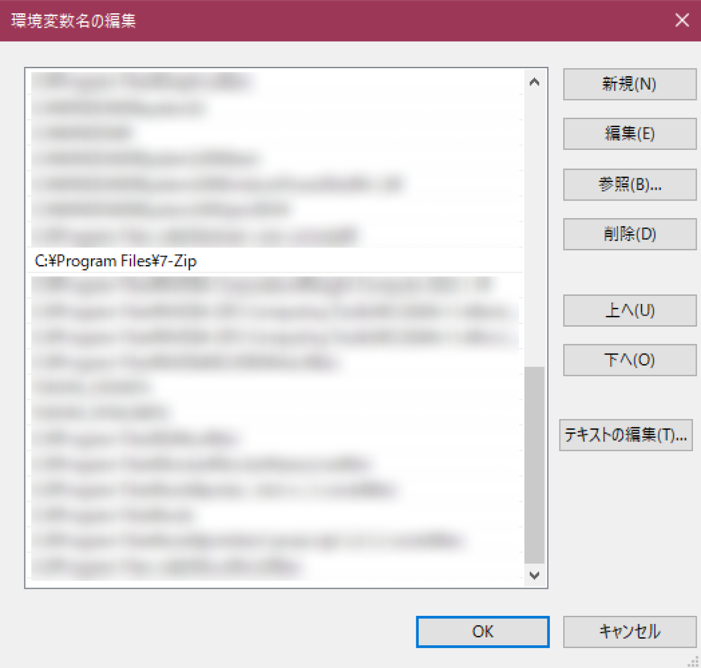
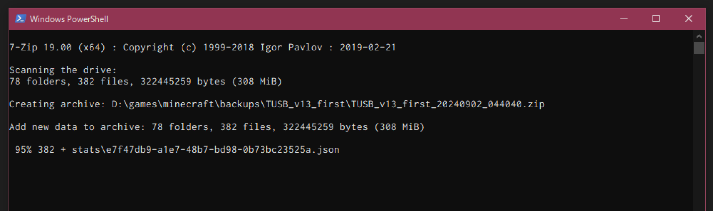

Minecraftをプレイ中に、 **1クリックでワールドのバックアップを取れる** ようにする。※Minecraft Java版、Windows限定

# 注意

事前に必ず、 **手動で既存ワールドのバックアップ** を取おう。やらかしてワールドデータ消えても自己責任。

# やること

**PowerShellスクリプト** で、指定したワールドをzip圧縮して指定場所に保存するプログラムを作る。zip圧縮には7-zipのCLI機能を使ってみる。あと、いつのデータか分かりやすいようにタイムスタンプも付ける。

# 準備

7-zipは[ここ](https://7-zip.opensource.jp/)からインストール。

7-zipをスクリプトから叩くには、パスを通しておく必要がある。 **7-zipのexeファイル自体にCLIの機能がある** ため、実行ファイルの場所を突き止めて直接パスに指定してあげればOK。

大体は `C:\Program Files\7-Zip\7z.exe` があると思うので、「システム環境変数の編集」から `Path` に `C:\Program Files\7-Zip` を追加しておけばいいと思う。



# バックアップを取るスクリプト

PowerShellスクリプトの拡張子は `.ps1` なので注意。Windowsのユーザー名、ワールドのフォルダ名、コピー先のパスは適宜書き換えて。

私の場合は、 `D:\games\minecraft\backups\`以下に各ワールドのバックアップを保存してる。

```powershell:backup.ps1
# ワールドデータのパス
$source = "C:\Users\【Windowsのユーザー名】\AppData\Roaming\.minecraft\saves\【ワールドデータのフォルダ名】\*"

# タイムスタンプ
$timestamp = (Get-Date -Format "yyyyMMdd_HHmmss")

# コピー先のパス（適宜書き換える）
$dist = "D:\games\minecraft\backups\【ワールドデータのフォルダ名】\【ワールドデータのフォルダ名】_" + $timestamp + ".zip"

# 圧縮
7z a -r $dist $source
echo "Back up: " $dist
```

バックアップを取るときは、 **ファイルをダブルクリック** すればいいだけ。こんな感じにウィンドウが起動して、勝手にバックアップを取ってくれる。



逆に復元するときは、保存されたzipファイルから手動で復元してる。こっちはそんなに頻繁にしないので自動化はしてない。

# 配布ワールドのデータを初期化するスクリプト

**配布ワールドのRTAを1クリックで再走** するスクリプトもおまけで置いておく。

```powershell:reset.ps1
# 配布ワールドのzipファイルがあるパス（適宜書き換える）
$source = "D:\games\minecraft\worlds\【配布ワールドのファイル名】.zip"

# ワールドデータのパス
$dist = "C:\Users\【Windowsのユーザー名】\AppData\Roaming\.minecraft\saves\【ワールドデータのフォルダ名】"

Remove-Item -Recurse -Force $dist
mkdir $dist
7z x -y $source -o$dist
```

# 最後に

[ **TUSB** ](https://skyblock.jp/the-unusual-skyblock/) **はいいぞ。** このスクリプトもTUSBのために作った。

6年前にこの動画を見てハマった記憶。

そういえば、最近新バージョン（v13）のα版が公開されてるらしい。めっちゃ色々変わっててびっくりした。超楽しみにしてます。