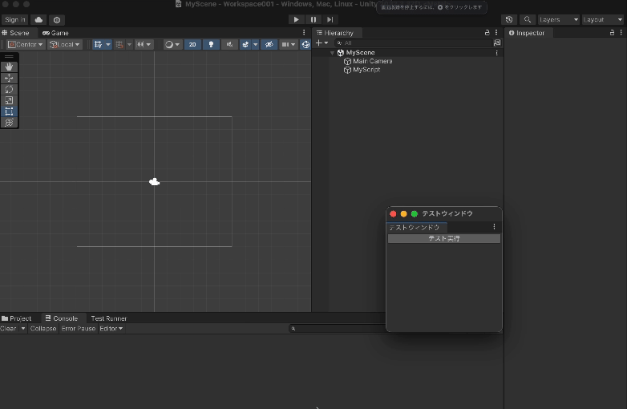

自作のEditorWindowから、特定のテストを実行できるようにしたかった。

# 環境

*   Unity 2022.3.37f1
*   Test Framework v1.1.33

# やること

[TestRunner API](https://docs.unity3d.com/Packages/com.unity.test-framework@1.1/api/UnityEditor.TestTools.TestRunner.Api.TestRunnerApi.html) を使って、ワンクリックで特定のPlayMode Testを実行できるEditorWindowを作ってみる。実行結果によって後処理も変えたいよね。



# 事前準備

TestRunnerを実行するにはasmdefを分けておく必要があるから、事前に済ませておく。

# 実装

ひとまず、テストの実行状態を管理したいから **マネージャークラス** を作る。 `ICallBacks` を実装してTestRunnerApiに登録すれば、TestRunnerに関するイベントを購読できるらしい。なんとなく `ScriptableSingleton` にしてるけど、別にC# Singletonでも問題ないと思う。

`Run()` が呼ばれたら実行対象などを設定してテストを開始し、結果は `TestFinished()` から受け取る。テストの結果は、事前に登録しておいたコールバックから受け取る。（そういえば、 `Run()` からコールバックを渡すとうまくいかなかったので注意）

注意すべきところはコメントにも書いてるけど、大体ここら辺。

*   テストケースの指定は `(名前空間).(クラス名).(メソッド名)` の形で渡す
*   スタックトレースはConsoleに出力されないので、自分で出力する必要がある
*   `TestFinished()` はテストが所属する親が実行されても呼ばれるので、末端かどうかの判定が必要

```csharp:TestManager.cs
using System;
using UnityEditor;
using UnityEditor.TestTools.TestRunner.Api;
using UnityEngine;

public class TestManager : ScriptableSingleton<TestManager>, ICallbacks
{
    private string _runningTestName;

    public Action<TestResultType, string> OnFinished;
    public bool IsRunning { get; private set; }
    private TestRunnerApi _testRunnerApi;

    [InitializeOnLoadMethod]
    public static void Initialize()
    {
        instance._testRunnerApi = CreateInstance<TestRunnerApi>();
        instance._testRunnerApi.RegisterCallbacks(instance);
    }

    void ICallbacks.RunStarted(ITestAdaptor testsToRun)
    {
        // テスト全体の開始時に呼ばれる
        IsRunning = true;
    }

    void ICallbacks.RunFinished(ITestResultAdaptor result)
    {
        // テスト全体の終了時に呼ばれる
        IsRunning = false;
    }

    void ICallbacks.TestStarted(ITestAdaptor test)
    {
        // 各テストの開始時に呼ばれる
    }

    void ICallbacks.TestFinished(ITestResultAdaptor result)
    {
        // 各テストの終了時に呼ばれる
        // テストはツリー構造になってて、親が実行されてもここは呼ばれるので弾く
        if (IsRunning == false || result.HasChildren || result.Test.FullName != _runningTestName)
        {
            return;
        }

        var status = result.TestStatus == TestStatus.Passed ? TestResultType.Passed : TestResultType.Failed;

        // スタックトレースはTestRunnerウィンドウに吸われてるのか、自分で出力しないとConsoleに出ないので注意 
        if (status == TestResultType.Failed)
        {
            Debug.LogError(result.Message + "\n" + result.StackTrace);
        }

        OnFinished?.Invoke(status, result.Message);

        _runningTestName = null;
    }

    public void Run()
    {
        const string nameSpace = "Sample.Tests";
        const string className = "MyTestClass";
        const string methodName = "MyTestCase";

        // テストの指定には、名前空間・クラス名・メソッド名があれば十分らしい（プロジェクト名やアセンブリ名は不要っぽい）
        _runningTestName = $"{nameSpace}.{className}.{methodName}";

        var filter = new Filter
        {
            testMode = TestMode.PlayMode,
            testNames = new[] { _runningTestName },
        };
        var settings = new ExecutionSettings { filters = new[] { filter } };
        _testRunnerApi.Execute(settings);
    }
}

public enum TestResultType
{
    None,
    Failed,
    Passed,
}
```

次に、このテストを実行する **EditorWindow** を作る。さっき作った **TestManager** のテスト終了時コールバックを購読し、ボタンが押されたときにテストを実行する。

```csharp:TestWindow.cs
using UnityEditor;
using UnityEngine;

internal sealed class TestWindow : EditorWindow
{
    [MenuItem("My Menu/テストウィンドウ")]
    private static void Open()
    {
        var window = GetWindow<TestWindow>();
        window.titleContent = new GUIContent("テストウィンドウ");
        window.Show();
    }

    private void OnEnable()
    {
        TestManager.instance.OnFinished += OnTestFinished;
    }

    private void OnDisable()
    {
        TestManager.instance.OnFinished -= OnTestFinished;
    }

    private void OnTestFinished(TestResultType status, string message)
    {
        if (status == TestResultType.Passed)
        {
            EditorUtility.DisplayDialog($"テスト結果", "テストの実行に成功しました！", "OK");
        }
        else
        {
            EditorUtility.DisplayDialog($"テスト結果", $"テストの実行に失敗しました。", "OK");
        }
    }

    private void OnGUI()
    {
        // テスト実行中とかエディタ再生中にテスト実行されると事故るので、対策
        GUI.enabled = TestManager.instance.IsRunning == false && Application.isPlaying == false;
        
        if (GUILayout.Button("テスト実行"))
        {
            RunTest();
        }
    }

    private void RunTest()
    {
        if (TestManager.instance.IsRunning || Application.isPlaying)
        {
            return;
        }
        
        TestManager.instance.Run();
    }
}
```

実際に走らせる **テストケース** を作っていく。コルーチンを含むテストの場合は、 `[UnityTest]` 属性をつける。シーンを読み込んだ後は、1フレーム待たないと `GameObject.Find()` で返ってこないので注意。

```csharp:MyTestClass.cs
using System.Collections;
using NUnit.Framework;
using UnityEngine;
using UnityEngine.SceneManagement;
using UnityEngine.TestTools;

namespace Sample.Tests
{
    public class MyTestClass
    {
        [UnityTest]
        [Timeout(5000)]
        public IEnumerator MyTestCase()
        {
            SceneManager.LoadScene("MyScene");
            yield return null;
            
            var myScript = GameObject.Find("MyScript")?.GetComponent<MyScript>();
            
            Assert.That(myScript != null);
            Assert.That(myScript.Add(1, 2), Is.EqualTo(3));
        }
    }
}
```

テストケースで登場した `MyScene` には、このスクリプトをアタッチしたGameObejctが置いてある。

```csharp:MyScript.cs
using UnityEngine;

public class MyScript : MonoBehaviour
{
    public int Add(int a, int b)
    {
        return a + b;
    }
}
```

# 最後に

テスト名の指定方法がどこにも載ってなくて苦戦した。