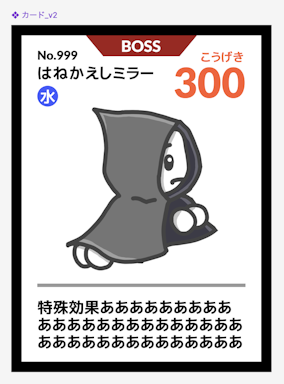
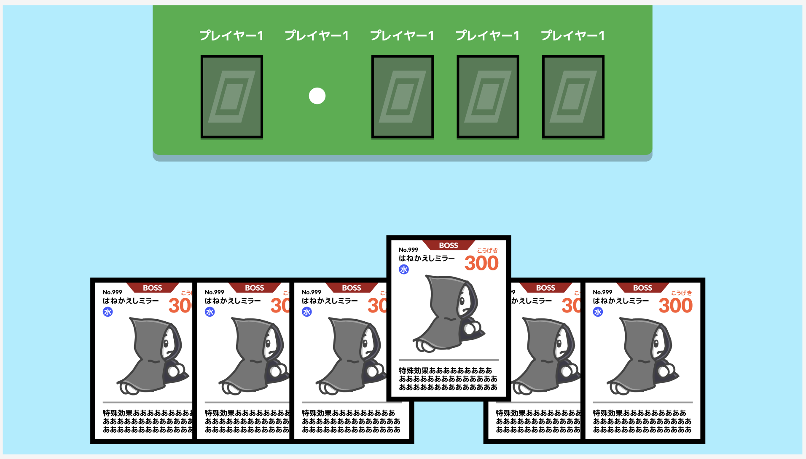
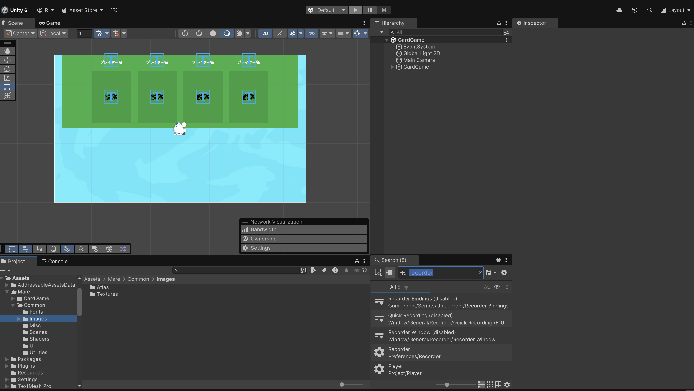
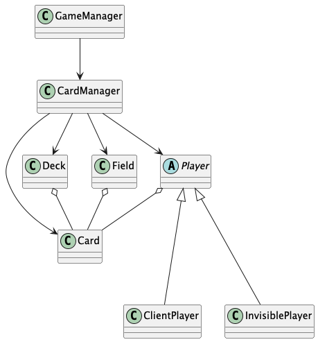
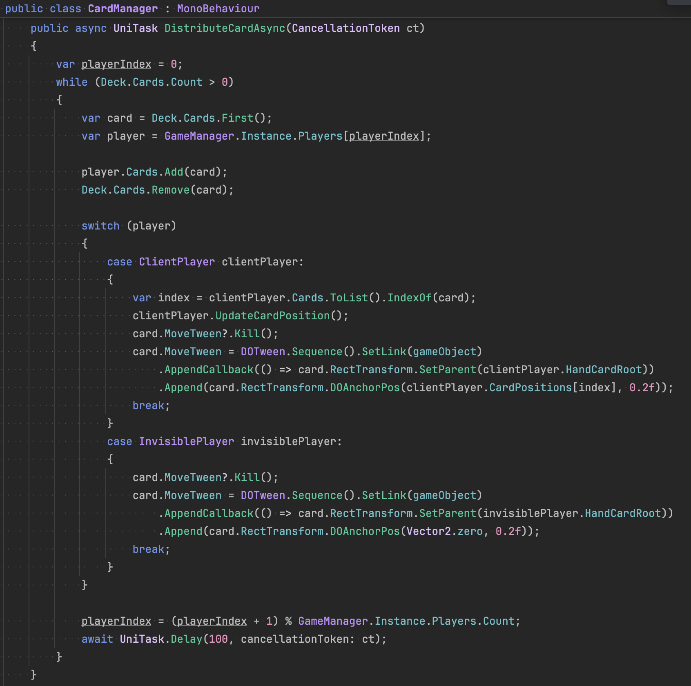
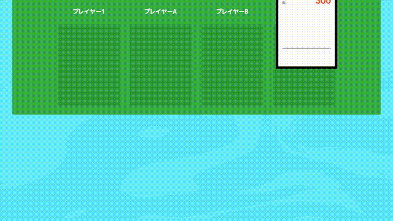
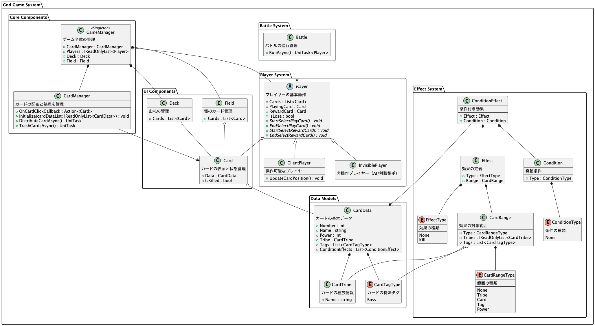
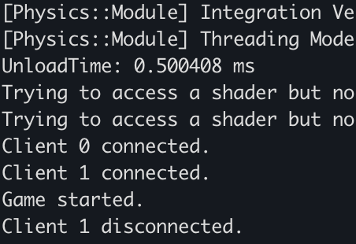

**「つよい方が勝ち」** っていうだけのカードゲームを作りたい。よし、オンラインゲーム作るよ！

# 攻撃力が高い方が勝ち

どういうこと？ってなるので軽くルールを説明しておくと、

*   全員にカードが10枚くらい配られる
*   みんなで同時にカードを1枚出し、 **「こうげき」が最も高いカードを出した人が勝ち**
*   勝った人は、出されたカードから1枚選んで貰うことができる（他は廃棄）
*   最後まで手元にカードが残った人の勝ち！

これだけ。

これだけ見れば本当に「つよい方が勝ち」だけど、カードはたまに

*   〇〇には勝つ！
*   こうげき300以上を無効化！
*   火タイプのこうげき2倍！
*   こうげきりょくが低い方が勝ち！

みたいな **特殊効果** を持ってて、しかも全部重複するから、 **誰が勝つかわからない** っていう仕掛け。

まずはFigmaで雑に **仮のUI** を作るよ。ほんとに適当だからなんもいわないで。

こういう時に自分のアイコン便利でいいんだよな。

**下に自分の手札があって、上側にみんながカードを出すフィールドがある** 、っていう感じ。一旦カードっていう感じの見た目にしたんだけど、手元にあるときと場に出てる時で優先したい情報が違うから、そこちゃんと別のUIにしないとな〜。

そしたら **プロジェクト構築** を済ませる。今回はUnityで作るよ。

後撮りだからなんかもういろいろあるけど、大体やったのはこのくらいかな。

*   プロジェクト生成
*   FontAssetCreatorでTextMeshProのアセット作る
*   大まかにさっき作ったUIパーツをPrefabで作る

今回Unity6にしたんだけど、思ったよりあんま変わってなくて助かった。

# 設計なんてこのくらいで十分

実装に入る前に **設計図** を書いておくよ。

**このゲームを遊ぶ時に実際に目の前にあるものを、そのまま落とし込んでみた。** 抽象化とか責務分割とか全然してないけど、ゲームの初期クラス設計はこのくらいの方が良いと思ってるよ。

## 以下設計のオタク語り

最近気づいたんだけど、 **ゲームのモック作る時って、大規模開発をするときと全然視点が違う。**

普段 **運用に耐える設計** をするときは、たとえば「このクラスはどういう文脈でどういう使われ方をして、そのためにはどういうクラスと依存関係を持っているのが正しいのか」みたいな、 **構造全体の視点を持つ** んだよね。というのも、大規模開発っていうのはシステムとして大きくなるし、それに伴って関わる人数も増えるから、なにかを変更・追加したくなったときに似たような実装（厳密には知識）は同じ場所に置いておかないと、システム全体のコードを見なきゃいけないし、何をしてもシステム全体に影響を与えることになっちゃう。

だから、大量の実装をうまーく **整理整頓** するんだけど、こうすると整理したもの同士を繋ぐために大量の処理が必要になる。そんな **大量の処理** が絡み合う中で、どのタイミングでどのオブジェクトがどういう状態になってるかを全部把握して考慮するのはさすがに無理だから、責務とか、抽象化とか、依存関係とかの **理屈ベース** で概念（クラスやインタフェース）同士の構造を担保する。こうすることによって、いろんな機能追加や変更修正に耐えるようになる、っていう考え方。

* * *

それに対して、ゲームのモックを作るのに必要なのは、今目の前で動いてほしいものをシナリオベースで **具体的** に作ることなんだよね。カードがプレイヤーからデッキに移動するのであれば、それをそのまま書く。カードが任意の場所から任意の場所へ移動する、みたいな抽象化をする必要はない。

っていうのも、ゲームのクリエイティブを詰めるときって「これをしたときに、こうしたい」みたいな具体の要望が多いんだよね。アニメーションとかは特にそう。だから **下手に構造化しちゃうと、かえって作りにくくなる** ことがある。それにゲームって元から概念の数が多いのにそれら同士が全部関係を持ったりするから、整理するより単純化する方が大事だったりする。

今回も、大規模運用のための構造ベースの視点で設計するなら、Deck, Field, PlayerにはICardHolderみたいなinterfaceを噛んだり、ゲームロジック全体を一個の独立したシステムにするんだよね。でも今回は、具体の視点で目の前にある「もの」をそのまま落とし込んだよ。

* * *

……設計の話をしたら熱くなっちゃった。

この辺の話好きだからまた後でしたい。データを切り離すのは楽だけど制御を切り離すのはめっちゃコスト高いよって話とか。

# あるものを見たまま書く

そしたら **コードを書いて実装** していくよ。

これは **ゲーム全体の流れ** をもつ部分。カードを配って、ターンを初期化して、プレイヤー全員がカードを出すまで待って、出されたら勝利判定。勝ったプレイヤーに取るカードを選ばせる。ほぼ英語のようにそのまま読めるんじゃないかな。

それぞれの **細かい実装** はこんな感じ。ビューとロジックが同じ場所に書いてるけど、こっちの方が便利なのでこうしてる。どっちみちマルチプレイ対応するときに分離するからね。

という感じにして、 **全体のゲームループが動くようになった。**

ちなみにこの愉快なアニメーションはClaudeくんにお願いしてDOTweenで作ってもらいました。最初のうちからこういう細かいクオリティアップをしておくと、最終的な実装イメージが湧きやすいのでおすすめ。というかゲームを作る時は最初で大体決まってる。

最終的にできたコードを **クラス図** にするとこうらしい。Claudeくんが描いてくれた。

# 次回：いざ、マルチプレイ

ゲームが完成したから、次はいよいよマルチプレイのためのゲームサーバーを立てていくよ！ちょっと技術寄りの話になるかもだけどよろしくね。

