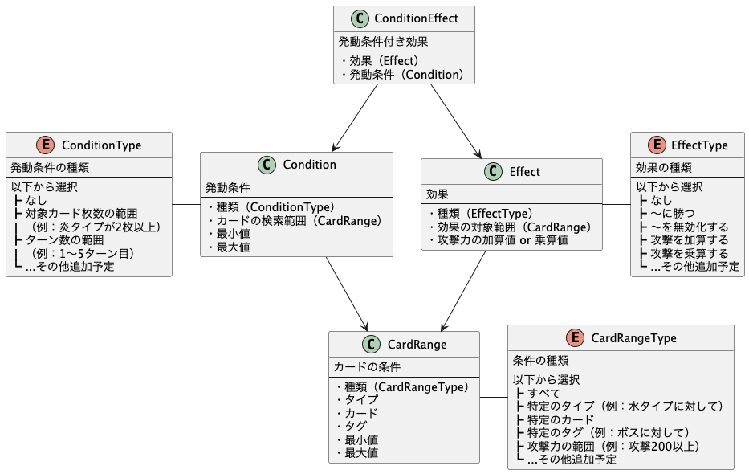
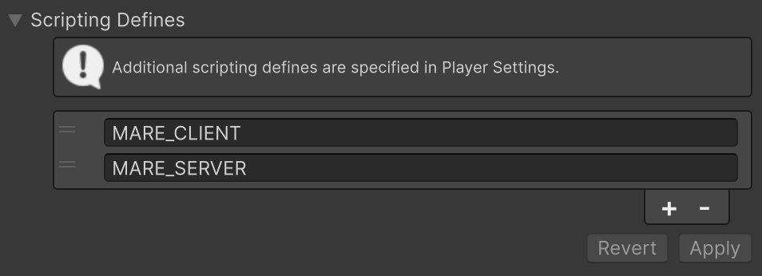
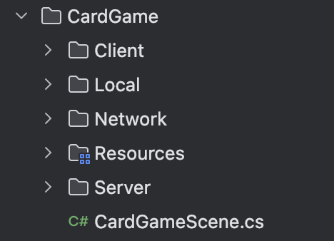
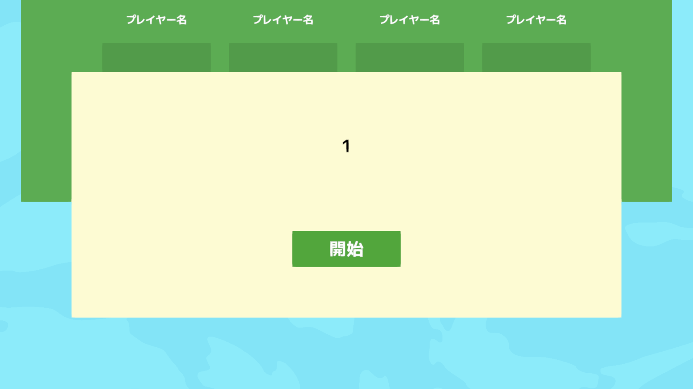
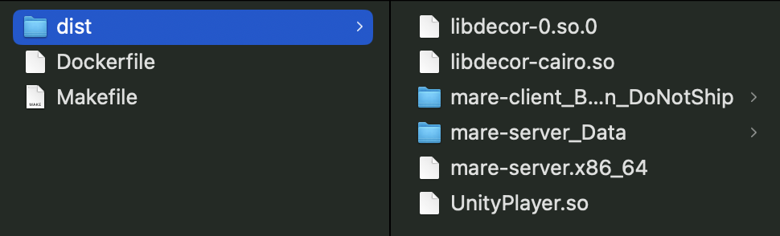
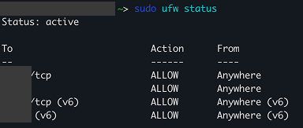
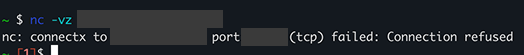
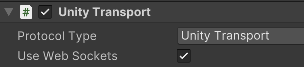
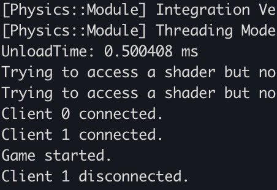

# 前回のあらすじ

[前回の内容はこちら！](https://www.2riniar.com/pages/5uvwzraln50l)

**「つよい方が勝ち」** というカードゲームを完成させた。


# カードエディターがほしい

今こんな感じにカードを設定してるんだけど、味気ないからいい感じの **カスタムエディター** が欲しいんだよね。


たとえばこんなカードがあったとする。「番号」「名前」「こうげき」「タイプ」「イラスト」はそのまま入力すればいい。


残りが **「こうげき100〜200には勝つ！」** みたいな部分で、ここは効果処理のためにこんな **構造** を組んでるんだよね。



問題なのは、選択したTypeによっては **必要ないプロパティ** まで設定項目に存在してるってこと。あと効果文もゲームを再生してみないと表示されない。（この図作ってて思ったけど、 `Condition` は `BattleCondition` に改名した方がいいし、 `CardRange` は `CardCondition` に改名した方がいいな）

ただUnityのカスタムエディタって、作るの超絶めんどいんだよね……。AIに投げてもいいけど、テストフロー整備できないからそんな期待できないし。

```:claude
/serena CardDataを視覚的に編集しやすいよう、カスタムエディタを作成してください -t -s -c

要件
・視覚的にわかりやすく、誰が見ても一目でわかるUI/UXにする
・無意味な設定項目は非表示にする
・極力少ないクリック回数で、新規カードを設定できるようにする
・効果説明文をプレビューできる
```

うん。まあ、そうだよね。そりゃ無理（スクショすら撮ってなかった）

UI Toolkitの挙動と表示をテストする機構、待ってます。

# 本題

**マルチプレイ。** ずっとこれがやってみたかった。

構想はあって、Unityの[Netcode for GameObjects](https://docs.unity3d.com/Packages/com.unity.netcode.gameobjects@2.5/manual/index.html)を使ってカードゲーム部分のクライアントとサーバーを実装し、 **サーバーアプリ** は[Dedicated Server](https://docs.unity3d.com/ja/2022.3/Manual/dedicated-server.html)でビルドする。このサーバーアプリ1個が、要するに **1ルーム分** に相当する。

discord用の変なbotたちを動かしてる個人用VPSがあるので、そこでサーバーアプリを **5個くらい** 稼働させて、ポートで接続先を分岐させる。こうすれば、 **ルームを選択** してみんなでカードゲームができる！

https://x.com/2RiniaR/status/1957827956463792243?ref_src=twsrc%5Etfw

超原始的だけどこのくらいでいい。こういう **クラフト感** のあるやつが好き。

**ロビーサーバー** を作るつもりはないけど、作るとしたら複数のゲームサーバーからHTTPリクエストを送ってもらって状態更新を通知するイメージかな。

* * *

## マルチプレイの仕組み

余談だけど、ゲームのマルチプレイっていうのは大きく2つの実装方法があって、それが **「P2Pでマッチングさせる方式」** と **「サーバーにみんなでアクセスする方式」** 。

「P2Pでマッチングさせる方式」は、N人のクライアントアプリが接続しあってネットワークを構築し、誰か1人が **ホスト** となってサーバー兼クライアントの振る舞いをする。ただ、インターネットの海を超えて接続先を見つけたり見つけてもらったりするのは相当な手間がかかるので、そこで運営が用意したサーバーがアプリ同士の **マッチング** を担当する。これが「リレーサーバー」って呼ばれてるやつだね。

**Minecraft** を身内でマルチプレイしようと思うと、サーバーを建てて、一緒に遊ぶ人に自分の **IPアドレスとポート** を教えて入力してもらう必要があるじゃん？あれを **リレーサーバー** が自動で管理してるイメージ。試したければ、リレーサーバーはUnity CloudとかPhotonが一定接続数までなら無料で提供してくれてるので、それを使うこともできる。

そして今回使うのが、「サーバーにみんなでアクセスする方式」。これは言わずもがな、クライアント・サーバーシステムそのままだね。運営が用意した **サーバー** でゲームを動かして、そこに各プレイヤーが **クライアント** として接続する。サーバーはセッション（簡単に言えば状態）を保持するので、この手のゲームなら **1ルームにつき1プロセス** にしておくと最小単位で区切れていい感じ。ロビーみたいなのを用意してリアルタイムに各ルームの状況を表示したいってなると、専用の **ロビーサーバー** を立ててそこに接続する形になる。

# ゲームのマルチプレイ対応

Netcode for GameObjectsを導入して、実装に組み込んでくよ。

まず、カードゲームって **相手の手札は見えない** から、プレイヤーによって違うものを表示できるように、データとビューを分けないとね。


構想としては、 **View** だけを別クラスに分けて、サーバー側では **NetworkObject** にしたモデルクラスを **RPC** で呼び出し、そこからクライアントでViewを呼び出す。こうすれば、Game, Card, Field, Player, Deck あたりをNetworkObject化するだけでよさそう。

ただちょっと複雑なのが、リソースを同期する仕組み上、今回は **サーバーもクライアントも同じソースコード** で実装するんだよね。要は、こんな感じの分岐でサーバーの処理とクライアントの処理を書き分けなきゃいけない。

```csharp
if (isServer)
{
    // サーバーで実行する処理
}
else
{
    // クライアントで実行する処理
}
```

**「サーバー専用」「クライアント専用」「共通」** の処理が散らばってると収集付かなくなるから、わかりやすくしておこう。こんな感じでサーバーとクライアント用のシンボルを切っておいて、専用処理はこの中に書く。



**フォルダ** もServer, Client, Networkで分ける。Serverにはサーバー用、Clientにはクライアント用の **エントリーポイント** がそれぞれ入っていて、そこからNetworkにあるオブジェクトを操作する感じ。



一旦、アドレスとポート指定でサーバーへ接続して、接続されたら画面に番号が表示される実装だけ入れてみた。これで **接続テスト** してみよう。



**コマンドライン引数** を読めば、サーバー起動時にアドレスやポートを指定することができるらしい。ちなみに `Awake()` にするとまだNetworkManagerの初期化が終わってなかったりするから、 `Start()` でやると良いよ。

```csharp
#if MARE_SERVER
private void Start()
{
    var args = Environment.GetCommandLineArgs();
    ushort port = 7777;
    var addr = "127.0.0.1";

    for (var i = 0; i < args.Length; i++)
    {
        if (args[i] == "-server")
        {
            addr = args[++i];
        }

        if (args[i] == "-port")
        {
            port = ushort.Parse(args[++i]);
        }
    }

    StartServer(addr, port);
}
#endif
```

サーバー用の **Linux Serverビルド** 、クライアント用の **MacOSビルド** が両方できた。テストしづらいのでMacOSにしてるけど、本番は多分WebGLビルドにする。

# 接続

当たり前だけど、Macでサーバービルドしないとlocalhostで動かせないんだよね。だけど本番想定はLinuxだし、 **docker** でいい感じにできないかなって。

そう思ったけど手元にあるのは **AppleSiliconのMac** だった、amd64向けのビルドだからそりゃ動かないね。頑張ってarmからamd64のdockerイメージを動かせないか試したけど、どうやら無理そう。armからx86\_64向けのコンテナをビルドするのは簡単にできるのに、その逆ってこんなにしんどいのか。

もういっそ、amd64のdockerイメージにして **個人VPSに置いちゃうか！**

```dockerfile
FROM ubuntu:latest AS runtime
COPY ./dist .
ENTRYPOINT ["./mare-server.x86_64"]
CMD ["-server", "0.0.0.0", "-port", "7777"]
```

そういえば初歩的だけど、 **ビルドの出力先** は空のディレクトリを指定した方が良い。間違って変な場所にばら撒いちゃって仕方なくかき集めてたら、普通にビルドバイナリの依存ファイルが漏れたから。



dockerイメージにできたので、 **個人VPSに移動** してMakefileで起動。適当な専用ポートを決めて、 **ファイアウォールの設定** を書き換えるよ。（ufwのreload忘れにより一敗）



なんか上手く行かない？って思ったら、 `--port` っていうコマンドライン引数が **Unity組み込みの引数と衝突** して吸われてた。

無事起動を確認。そしたら今度はnetcatで **pingが通るか確認** してみる。



通らないな、なぜ……ああ、dockerコンテナ内なのにアプリで **バインドしてるアドレス** がホストマシンのIPだった。 `0.0.0.0` に変更。

```shell
$ docker run -d --name mare-server-container --platform linux/amd64 -p 7777:7777 mare-server-image -server 0.0.0.0 -p 7777
```

それでも通らないなって思ったら、どうやらUnityTransportって **デフォルトでUDP** らしい。TCPしかフォワーディングしてなかった。設定で選べるみたいなので、今回はカードゲームであることを考慮して **WebSocketへ変更** 。



再度クライアントアプリをEditorから起動してみる。



**通過！！！** この瞬間が一番楽しい！！！

# 次回：オンライン対戦

無事にサーバーとアプリの疎通が確認できたから、次はゲーム部分をマルチプレイ化して、 **オンライン対戦** ができるようにしていくよ！そのために、 **マルチプレイを手元でデバッグ** できる開発環境を整備しないとね。

