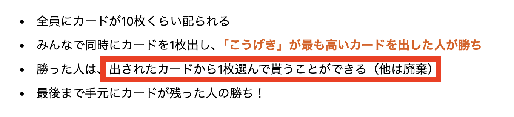
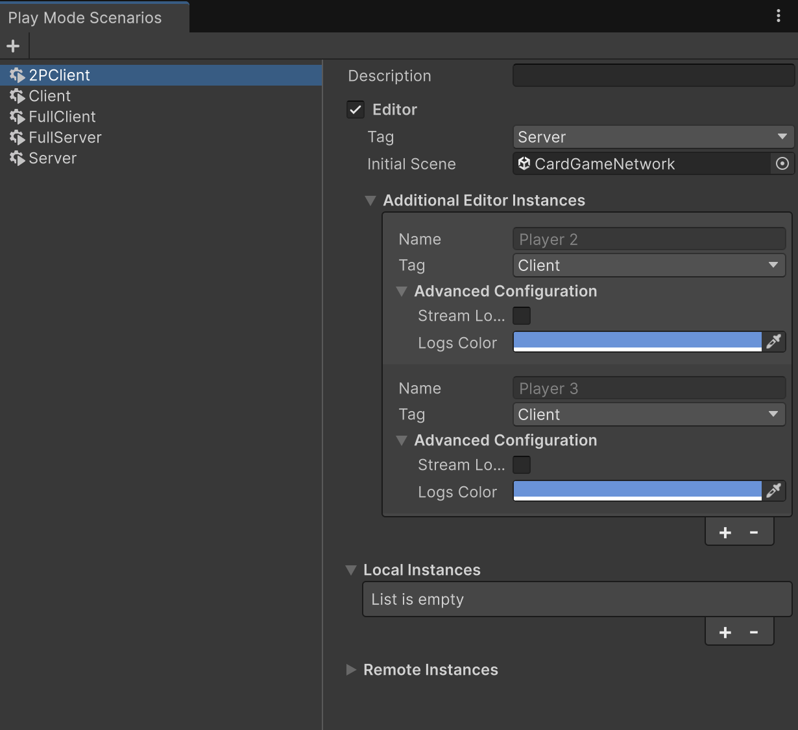
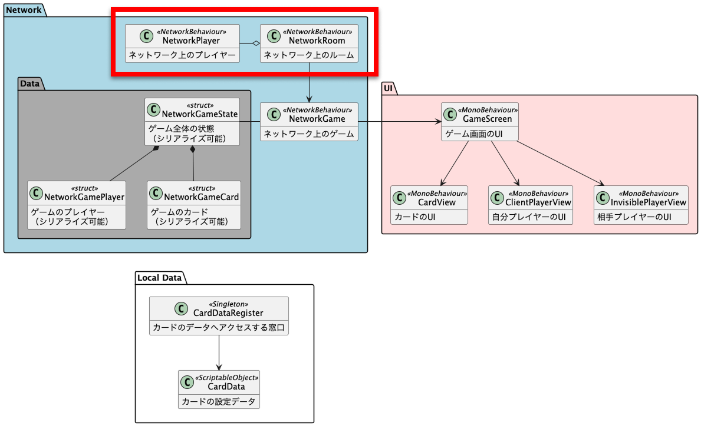
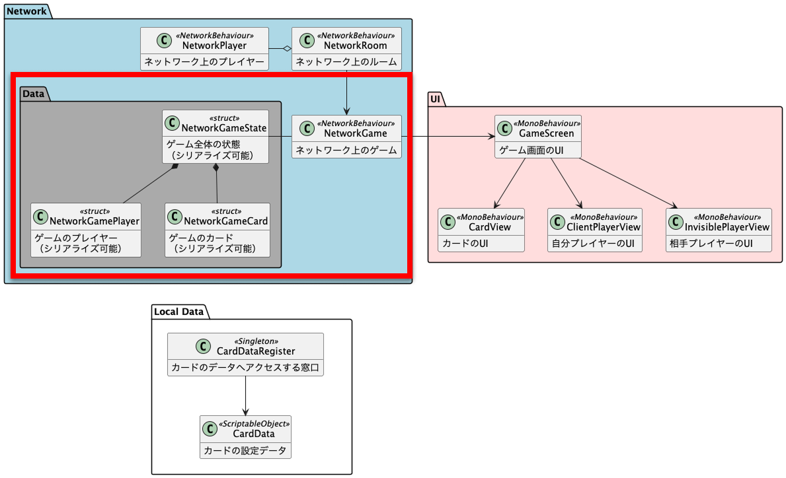
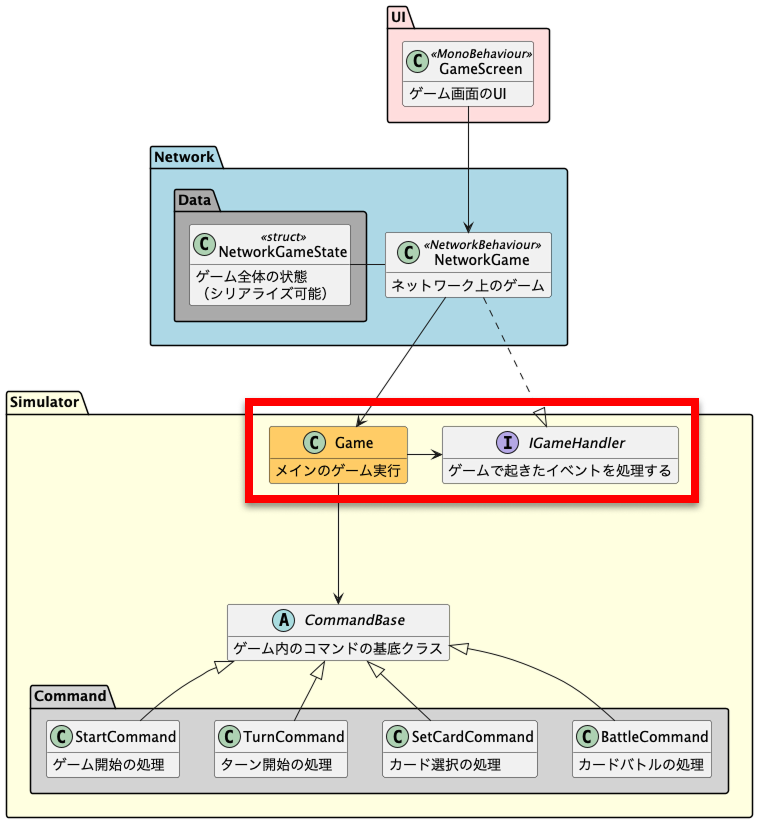
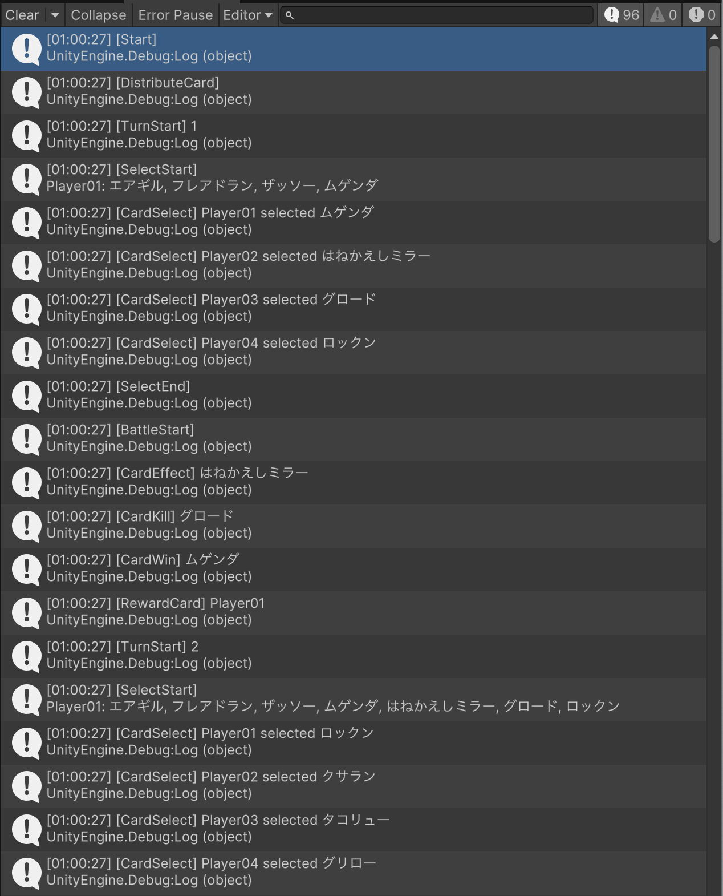
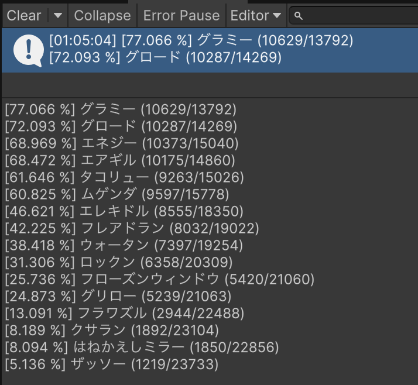
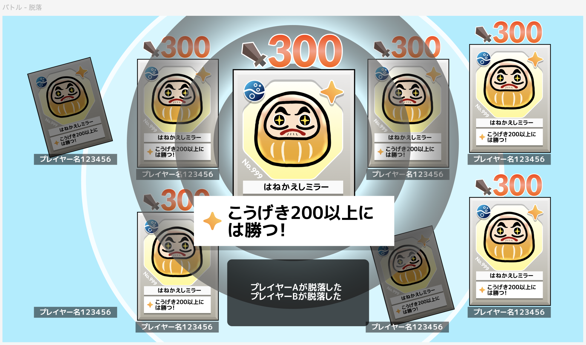

ゲームルールのこの部分を、「選んだ1枚」じゃなくて、 **全部もらえるようにした。** こうするとプレイヤーのカードが減らなくなっちゃうから、代わりにターン制限を設けて、「一番枚数が多いプレイヤーが勝ち」にする。

というのも、今回のゲームにはこんなコンセプトがある。

*   影響が重なって **カオスな状況** ができる
*   **大人数** で盛り上がり続ける
*   **やめどきがない**

この「大人数で盛り上がり続ける」「やめどきがなく延々と遊べる」を満たすには、 **カードは減らない方が良い** って思った。

実はこのゲームには元ネタというかオリジナルがあって、そっちは勝てば場に出てるカードが全部もらえるんだ。それをちょっと改変してたんだけど、実装してみたらやっぱり絵面が微妙だなぁって思って、戻すことにした。

そういえばそろそろゲームタイトル考えなきゃな……ずーーーーーっと、なんなら作り始める前から考えてるんだけど全然パッときてないないんだよな。

# 本編

サーバーアプリの環境は作ったから、いよいよゲームの **マルチプレイ化** をしていきたいんだけど  
流石に毎回サーバーをビルドしてデプロイ、みたいなことはやってられないから、マルチプレイの **デバッグ環境** を整えていく。

やり方は簡単で、 **MPPM（MultiPlayer Play Mode）** を使う。これを使うとPlayMode Scenarioっていうのを作ることができて、PlayModeの実行時に別のEditorを起動して同時に実行できる。一時期は壊れてリロードが走らないこともあったみたいだけど、投稿時点では無事に治ってそう。


**PlayMode Scenario** はこんな感じに設定。今回はEditorを指定したんだけど、LocalやRemoteにするとPlayModeを実行するたびにビルドが走るので、Editor推奨。



**Tag** っていうのがあるんだけど、これを指定するとスクリプトから読んで実行を分岐することができる。今回はServerとClientを指定して、処理を分岐する。インスタンスごとに **Build Profile** を切り替えることはできないから、Build Profileは `MARE_CLIENT` と `MARE_SERVER` の両方のコードを含むDevelop用のをActivateしておくよ。

```csharp:CardGameScene.cs
private void Start()
{
#if UNITY_EDITOR
    // Serverタグが振られていたら、サーバーとして起動
    if (CurrentPlayer.ReadOnlyTags().Contains("Server"))
    {
        StartServer("127.0.0.1", 7777);
    }
#elif MARE_CLIENT
    /* 省略 */
#elif MARE_SERVER
    /* 省略 */
#endif
}
```

詳しく知りたい人のためにリンクを貼っておくよ。

[https://docs.unity3d.com/Packages/com.unity.multiplayer.playmode@1.6/manual/play-mode-scenario/play-mode-scenario-create.html](https://docs.unity3d.com/Packages/com.unity.multiplayer.playmode@1.6/manual/play-mode-scenario/play-mode-scenario-create.html)

あと、これで起動すると別インスタンス側でCodeAnalyzerの警告がめちゃめちゃ出まくるから、一旦アンインストールした。

# 通信の実装

今まで作ったものをオンライン化していくわけだけど、まずは Netcode for GameObjects における **通信の仕様** を把握しないといけない。要するに、NetworkVariableやRPCにおける **データや順序の整合性がどのくらい保証されるか** だ。

例えば変数Aと変数Bの2つを同期しようとしたとき、データや順序の整合性が保たれていないと、

*   変数Aは同期されたが、変数Bは **同期されていない**
*   変数Aを先に更新したのに、変数B **が先に更新された**

みたいなことが起こり、変数の更新をハンドリングしてた時におかしな結果になってしまう。それでNetcode for GameObjectsはどうかというと、調べたけどあんまり明記されてなかった。明記されてたのはこれだけ。

[https://docs.unity3d.com/Packages/com.unity.netcode.gameobjects@2.5/manual/advanced-topics/message-system/reliability.html](https://docs.unity3d.com/Packages/com.unity.netcode.gameobjects@2.5/manual/advanced-topics/message-system/reliability.html)

> Reliable RPCs will be received on the remote end in the same order they are sent, but this in-order guarantee only applies to RPCs on the same NetworkObject. Different `NetworkObjects` might have reliable RPCs called but executed in different order compared to each other. To put more simply, **in-order reliable RPC execution is guaranteed per NetworkObject basis only** . If you determine an RPC is being updated often (that is, several times per second), it _might_ be better suited as an unreliable RPC.

要するに、 **同じNetworkObject内でのRPCだけは順序保証がされる。** おそらく多分、これ以外のケースではデータも順序も整合性が保証されないんだろう。

* * *

まずは **ルームの入退室** から作っていく。今どこを作ってるのかわかりやすくするために、先に完成図の設計を載せておくよ。



`NetworkRoom` にルームの同期したい情報（プレイヤーなど）を集約する。 `NetworkPlayer` をPlayerPrefabとして指定し、プレイヤーが入室したら `NetworkRoom` に `NetworkList<NetworkBehaviourReference>` として持たせ、クライアント間で同期する。プレイヤー間でデータに整合性を持たせる必要はないので、この実装で問題ない。

ゲームの開始はクライアントから `RequestStartGameRpc()` で **RPC** を行い、サーバー側で `NetworkGame` に開始の信号を送る。

```csharp:NetworkRoom.cs
/// <summary>
/// ネットワーク上の部屋
/// 最初からシーンに配置される
/// </summary>
public class NetworkRoom : NetworkBehaviour
{
    private NetworkList<NetworkBehaviourReference> _playerReferences;
    public NetworkRefListProperty<NetworkPlayer> Players { get; private set; }  // 扱いづらいのでラッパークラスを作った
#if MARE_SERVER
    [SerializeField] private NetworkGame _game;
#endif
    private void Awake()
    {
        _playerReferences = new NetworkList<NetworkBehaviourReference>();
        Players = new NetworkRefListProperty<NetworkPlayer>(_playerReferences);
    }

    [Rpc(SendTo.Server)]
    public void RequestStartGameRpc()
    {
#if MARE_SERVER
        _game.Setup(Players, CardDataRegister.Instance.GetAll(), 10);
        OnStartGameRpc();
        _game.Run();
#endif
    }

    [Rpc(SendTo.NotServer)]
    private void OnStartGameRpc()
    {
#if MARE_CLIENT
        Debug.Log("[Client] Game Start");
#endif
    }

#if MARE_SERVER
    public void AddClient(ulong clientId)
    {
        Debug.Log($"Client {clientId} connected.");

        var player = NetworkManager.ConnectedClients[clientId].PlayerObject.GetComponent<NetworkPlayer>();
        Players.Add(player);
        player.transform.SetParent(transform);
    }

    public void RemoveClient(ulong clientId)
    {
        Debug.Log($"Client {clientId} disconnected.");

        var player = Players.FirstOrDefault(x => x.OwnerClientId == clientId);
        if (player != null)
        {
            Players.Remove(player);
            player.NetworkObject.Despawn();
        }
    }
#endif
}
```

* * *

次に作っていくのが **ゲーム実行部分。** 全体のコードが見たい人は、コードだけコピーしたリポジトリを用意したので、ここから見てね。

[https://github.com/2RiniaR/mare-client-lib/blob/main/CardGame/Network/NetworkGame.cs](https://github.com/2RiniaR/mare-client-lib/blob/main/CardGame/Network/NetworkGame.cs)



`NetworkGame` （図の真ん中くらいにある）がメイン実行部分となって、全体の制御を持つ。 **ゲームロジックはサーバーでだけ実行** し、何らかの表示更新や演出が必要なタイミングで、クライアントに向けてRPCを行う。

```csharp:NetworkGame.cs
public class NetworkGame : NetworkBehaviour
{
    private CancellationToken Ct => destroyCancellationToken;

#if MARE_SERVER
    public void Run()
    {
        RunAsync(Ct).Forget();
    }

    private async UniTask RunAsync(CancellationToken ct)
    {
        // ゲームロジック
        // カードの効果発動時に、OnCardEffectRpc を呼ぶ
    }
#endif

    // カードの効果が発動した時に、サーバーからクライアントに対して呼ばれる
    [Rpc(SendTo.NotServer)]
    private void OnCardEffectRpc(NetworkGameState state, uint cardUid, uint syncToken)
    {
#if MARE_CLIENT
        // UIの更新や演出
#endif
    }
}
```

サーバーからクライアントにRPCを送る時に `NetworkGameState` というデータを送っているけど、これには **ゲーム内の全ての状態** が含まれてる。つまり、なんらか表示を更新してほしいタイミングで、最新の状態を全部送ってるということ。

なぜこうしてるかというと、 **通信って確実に届くものじゃない** ので、差分データだけ送るみたいなことをやるとクライアント側で間違った状態が表示されてしまう。アクションゲームとかなら多少の誤差はいいんだけど、 **カードゲームでそれはまずい** ので、毎回全部の状態を確実に同期してる。

```csharp:NetworkGameState.cs
public struct NetworkGameState : INetworkSerializable
{
    public uint Turn;
    public uint LimitTurn;
    public NetworkGamePlayer[] Players;
    public NetworkGameCard[] Cards;

    public uint[] TurnPlayerUids;
    public uint[] DeckCardUids;
    public uint[] FieldCardUids;

    public void NetworkSerialize<T>(BufferSerializer<T> serializer) where T : IReaderWriter
    {
        serializer.SerializeValue(ref Turn);
        serializer.SerializeValue(ref LimitTurn);
        serializer.SerializeValue(ref Players);
        serializer.SerializeValue(ref Cards);
        serializer.SerializeValue(ref TurnPlayerUids);
        serializer.SerializeValue(ref DeckCardUids);
        serializer.SerializeValue(ref FieldCardUids);
    }
}
```

そしてRPCを呼ぶ時にもう一つ、 `syncToken` っていう引数を渡してる。これはサーバーがクライアントに **RPCを行うたびにカウントアップ** していく番号で、以下の役割がある。

*   サーバーが **クライアントの処理（主にアニメーション）を待つ**  
    ┗ クライアントから処理完了時に同じ番号を送り返してもらい、全クライアントが指定の番号になるまで待つ
*   クライアントが **通信失敗を検知する**  
    ┗ 番号が飛んでいれば通信がスキップされているので、アニメーションせずにUIを即時反映する

```csharp:NetworkGame.cs
public class NetworkGame : NetworkBehaviour
{
#if MARE_SERVER
    private NetworkGameState _serverGame;
    private uint _serverLastSyncToken;
    private Dictionary<ulong, uint> _serverClientSyncTokens;
#endif
#if MARE_CLIENT
    public NetworkGameState ClientGame { get; private set; }
    private uint _clientLastSyncToken;
#endif

#if MARE_SERVER
    private uint CreateSyncToken()
    {
        return ++_serverLastSyncToken;
    }

    // 全クライアントの同期が取れるまで待つ
    private async UniTask SyncClientAsync(CancellationToken ct)
    {
        await UniTask.WaitUntil(
            () => _serverGame.Players
                .Where(x => x.ClientId != NetworkManager.LocalClientId)
                .All(x => _serverClientSyncTokens.TryGetValue(x.ClientId, out var current) &&
                          current == _serverLastSyncToken),
            cancellationToken: ct);
    }
#endif

#if MARE_CLIENT
    private bool ValidateSync(NetworkGameState state, uint syncToken)
    {
        ClientGame = state;

        var isValid = syncToken == _clientLastSyncToken + 1;
        _clientLastSyncToken = syncToken;

        if (isValid == false)
        {
            // syncTokenが連番でなければ、正常に同期できてないとみなし演出アニメーションを行わずに強制反映する
            _screen.SetGameImmediate();
            RequestSyncRpc(syncToken);
        }

        return isValid;
    }
#endif

    [Rpc(SendTo.NotServer)]
    private void OnCardEffectRpc(NetworkGameState state, uint cardUid, uint syncToken)
    {
#if MARE_CLIENT
        if (ValidateSync(state, syncToken) == false) return;
        // カード効果発動のアニメーション
        // 終わったら RequestSyncRpc(syncToken) を呼ぶ
#endif
    }

    [Rpc(SendTo.Server)]
    public void RequestSyncRpc(uint syncToken, RpcParams rpcParams = default)
    {
#if MARE_SERVER
        var clientId = rpcParams.Receive.SenderClientId;
        if (_serverClientSyncTokens.TryGetValue(clientId, out var current) && syncToken <= current) return;
        _serverClientSyncTokens[clientId] = syncToken;
#endif
    }
}
```

残りのUI表示とかリソース読み込みの部分は特に書くこともないので省略。こんな感じで、マルチプレイでカードゲームが1戦回せるようになった。


# シミュレータを回してみる

カードゲームだと先にやっておきたいことがあって、それが **通信や表示なしでゲームを実行** すること。これができると、プレイヤーの操作が可能かをクライアントだけでチェックできたり、ゲームバランス調整用のシミュレータが作れたりする。

そこで、こんな感じにゲーム実行部分だけを `NetworkGame` から切り出してみた。



まずゲーム処理の中で、今まで通信を挟んでいた部分をすべて `IGameHandler` に記述する。あとは通信以外のゲーム処理をすべて `Game` に移動し、 `NetworkGameState` との相互変換処理を書いたら完了。

```csharp:IGameHandler.cs
public interface IGameHandler
{
    UniTask OnStartAsync(CancellationToken ct);
    UniTask OnDistributeCardAsync(CancellationToken ct);
    UniTask OnTurnStartAsync(CancellationToken ct);
    UniTask OnSelectStartAsync(CancellationToken ct);
    UniTask OnCardSelectAsync(Player player, Card card, [CanBeNull] Card returnCard, CancellationToken ct);
    UniTask OnSelectEndAsync(CancellationToken ct);
    UniTask OnBattleStartAsync(CancellationToken ct);
    UniTask OnCardEffectAsync(Card card, CancellationToken ct);
    UniTask OnCardKillAsync(Card card, CancellationToken ct);
    UniTask OnCardWinAsync(Card card, CancellationToken ct);
    UniTask OnRewardCardAsync(Player player, IReadOnlyList<Card> cards, CancellationToken ct);
    UniTask OnPlayerDefeatAsync(IReadOnlyList<Player> players, CancellationToken ct);
    UniTask OnEndAsync(CancellationToken ct);
}
```

次に、「プレイヤーがカードを選択する」みたいな **ゲームを操作する部分** だけど、ちょっと工夫が必要。


このゲームでは「プレイヤー全員がカードを選んだとき、バトルを開始する」という部分があるが、この **「特定の状態を待つ」** というのは `UniTask.WaitUntil()` で実装してしまうと、 **Unityのメインループ** に依存してしまう。こうなると、シミュレータの実行環境次第で思わぬ実行停止や想定外の挙動が起こり得るので、それを避けるためにpush型のゲーム進行ができるようにしたい。

そこで、ゲームロジックを **コマンドに分割** し、コマンドキューに格納する形で実行することにした。それに加え、操作の実行タイミングを完全にシミュレータ内で制御できるのも良い。

`IGameHandler` を実装したシミュレータを用意し、ログを出力しながらゲームを実行してみた。 **16枚のカードを仮の性能でプールに加え、4人のダミープレイヤーにランダムなカードを選択** させている。



いい感じ。次に、ゲームを **10,000回実行** してカードの勝率を取ってみる。（メインスレッドで実行するとUnityEditorが固まるので、ThreadPoolに逃した）



「こうげき」が10しかないザッソーの勝率が5%もあるのが面白い。

*   はねかえしミラー（攻0、攻200以上を無効化）
*   グロード（攻300）
*   グラミー（攻270）
*   ザッソー（攻10）

とかが場に出てると、普通に勝つのかも。

# 次回予告

マルチプレイでゲームが動くようになったので、次回は **UIのデザイン** を本格的に入れていくよ。お楽しみにー！

